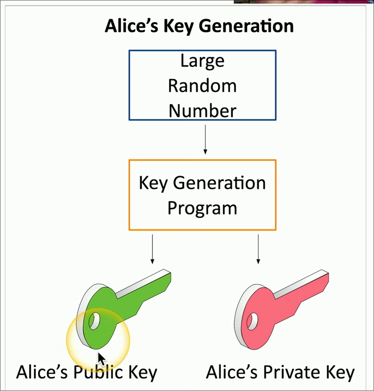
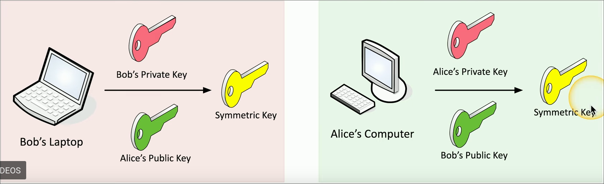
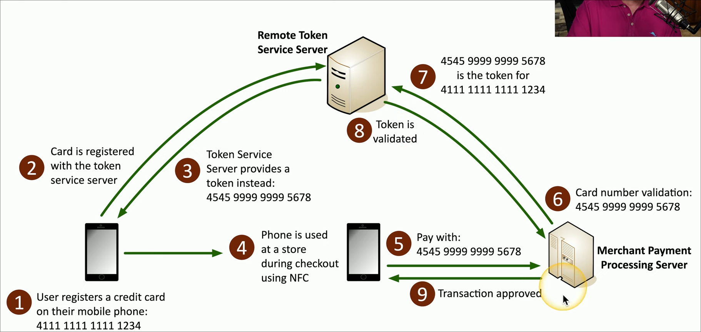
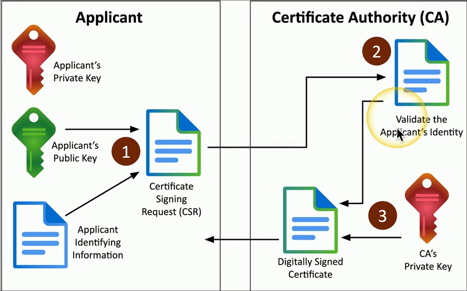

## Video 1.1.1: Security Controls #Security+
	- 
	- Security Risks
	- Assets
	- ### Preventative
	  background-color:: yellow
		- Technical Controls
			- Operating systems
			- Firewalls
			- Antivirus
			- Managerial Controls
				- Administrative controls with security design and implementation, these are telling your employees how to use a device securely and helping enforce that.
				- Day to Day aka procedural
			- Operational Controls
				- Controls implemented by people
				- example: Security Guards, awareness programs
			- Physical Controls
	- ### Deturrent #card
	  card-last-score:: 5
	  card-repeats:: 4
	  card-next-schedule:: 2025-02-20T16:41:25.313Z
	  background-color:: red
	  card-last-interval:: 31.36
	  card-ease-factor:: 2.8
	  card-last-reviewed:: 2025-01-20T08:41:25.313Z
		- Makes people second guess if they sould do what there about to do
			- Examples:
				- Splash Screen when logging into a system
				- Front reception desk
				- warning sighs
	- ### Detective #card
	  background-color:: pink
	  card-last-interval:: 31.36
	  card-repeats:: 4
	  card-ease-factor:: 2.8
	  card-next-schedule:: 2025-02-20T16:41:30.325Z
	  card-last-reviewed:: 2025-01-20T08:41:30.325Z
	  card-last-score:: 5
		- A way to log an attack, may not prevent or mitigate
			- Examples:
				- Login Reports
				- Regularly patrol an area
				- enable motion detectors
	- ### Corrective #card
	  background-color:: green
	  card-last-interval:: 28.3
	  card-repeats:: 4
	  card-ease-factor:: 2.66
	  card-next-schedule:: 2025-02-17T15:40:06.816Z
	  card-last-reviewed:: 2025-01-20T08:40:06.817Z
	  card-last-score:: 5
		- Apply a controller after the event has been enacted, this will mitigate the effects of the attack and create less downtime.
			- Examples:
				- Computer rollback
				- Contact law enforcement to manage criminal activity
				- use a fire extinguisher.
	- ### Compensating #card
	  background-color:: blue
	  card-last-interval:: 28.3
	  card-repeats:: 4
	  card-ease-factor:: 2.66
	  card-next-schedule:: 2025-02-22T14:05:29.828Z
	  card-last-reviewed:: 2025-01-25T07:05:29.829Z
	  card-last-score:: 5
		- Control using other means, exisitng controls are noty sufficent.
			- Examples:
				- Firewall blocks app with new vulnerability instead of patching the app
				- implement a separation of duties
				- More guards
				- Generator after power outage
	- ### Directive #card
	  background-color:: purple
	  card-last-interval:: 28.3
	  card-repeats:: 4
	  card-ease-factor:: 2.66
	  card-next-schedule:: 2025-02-17T15:40:16.048Z
	  card-last-reviewed:: 2025-01-20T08:40:16.048Z
	  card-last-score:: 5
		- Direct a subject towards security compliance, this is a weak security control.
		- Examples:
			- store all sensitive files in a protected folder
			- create a compliance policies and procedures
			- train users on proper security policies
			- post a sign for authorized personnel only
	- Whats an example of a preventative technical control? #card
	  card-last-interval:: 33.64
	  card-repeats:: 4
	  card-ease-factor:: 2.9
	  card-next-schedule:: 2025-03-14T06:31:21.242Z
	  card-last-reviewed:: 2025-02-08T15:31:21.243Z
	  card-last-score:: 5
		- Firewall
	- Whats an example of a deterrent technical control? #card
	  card-last-interval:: 28.3
	  card-repeats:: 4
	  card-ease-factor:: 2.66
	  card-next-schedule:: 2025-02-22T14:05:36.121Z
	  card-last-reviewed:: 2025-01-25T07:05:36.121Z
	  card-last-score:: 5
		- Splash Screen
	- Whats an example of a detective technical solution #card
	  card-last-interval:: 33.64
	  card-repeats:: 4
	  card-ease-factor:: 2.9
	  card-next-schedule:: 2025-03-14T06:31:31.832Z
	  card-last-reviewed:: 2025-02-08T15:31:31.833Z
	  card-last-score:: 5
		- System Logs
	- Whats an example of a corrective technical control #card
	  card-last-interval:: 33.64
	  card-repeats:: 4
	  card-ease-factor:: 2.9
	  card-next-schedule:: 2025-03-14T06:30:59.545Z
	  card-last-reviewed:: 2025-02-08T15:30:59.546Z
	  card-last-score:: 5
		- Backup recovery
	- Whats an example of a compensating technical control #card
	  card-last-interval:: 33.64
	  card-repeats:: 4
	  card-ease-factor:: 2.9
	  card-next-schedule:: 2025-03-14T06:30:49.459Z
	  card-last-reviewed:: 2025-02-08T15:30:49.460Z
	  card-last-score:: 5
		- Block instead of patch
	- Whats an example of a directive technical control #card
	  card-last-interval:: 33.64
	  card-repeats:: 4
	  card-ease-factor:: 2.9
	  card-next-schedule:: 2025-03-14T06:31:30.142Z
	  card-last-reviewed:: 2025-02-08T15:31:30.143Z
	  card-last-score:: 5
		- file storage policies
	- Whats an example of a preventative managerial control #card
	  card-last-interval:: 31.36
	  card-repeats:: 4
	  card-ease-factor:: 2.8
	  card-next-schedule:: 2025-03-11T23:29:18.002Z
	  card-last-reviewed:: 2025-02-08T15:29:18.002Z
	  card-last-score:: 5
		- on board policy
	- Whats an example of a deturent managerial control #card
	  card-last-interval:: 33.64
	  card-repeats:: 4
	  card-ease-factor:: 2.9
	  card-next-schedule:: 2025-03-14T06:31:24.057Z
	  card-last-reviewed:: 2025-02-08T15:31:24.058Z
	  card-last-score:: 5
		- Demotion
	- Whats an example of a detective managerial control #card
	  card-last-interval:: 4
	  card-repeats:: 2
	  card-ease-factor:: 2.9
	  card-next-schedule:: 2025-02-13T16:30:18.924Z
	  card-last-reviewed:: 2025-02-09T16:30:18.924Z
	  card-last-score:: 5
		- login reports
	- Whats an example of a corrective managerial control #card
	  card-last-interval:: 53.78
	  card-repeats:: 3
	  card-ease-factor:: 2.7
	  card-next-schedule:: 2025-04-03T09:39:03.067Z
	  card-last-reviewed:: 2025-02-08T15:39:03.067Z
	  card-last-score:: 5
		- policies for reporting issues
	- Whats an example of a compensating managerial control #card
	  card-last-interval:: 38.3
	  card-repeats:: 4
	  card-ease-factor:: 2.56
	  card-next-schedule:: 2025-03-18T22:41:35.117Z
	  card-last-reviewed:: 2025-02-08T15:41:35.118Z
	  card-last-score:: 5
		- Separation of duties (More people in a position to be checking each other)
	- Whats an example of directive managerial control? #card
	  card-last-interval:: 33.64
	  card-repeats:: 4
	  card-ease-factor:: 2.9
	  card-next-schedule:: 2025-03-14T06:42:13.215Z
	  card-last-reviewed:: 2025-02-08T15:42:13.216Z
	  card-last-score:: 5
		- Compliance polices
	- Whats an example of a preventative operational control #card
	  card-last-interval:: 53.78
	  card-repeats:: 3
	  card-ease-factor:: 2.7
	  card-next-schedule:: 2025-04-03T09:38:56.874Z
	  card-last-reviewed:: 2025-02-08T15:38:56.874Z
	  card-last-score:: 5
		- guard shack
	- Whats an example of a deterrent operational control #card
	  card-last-interval:: 53.78
	  card-repeats:: 3
	  card-ease-factor:: 2.7
	  card-next-schedule:: 2025-04-03T09:40:34.118Z
	  card-last-reviewed:: 2025-02-08T15:40:34.119Z
	  card-last-score:: 5
		- reception desk
	- Whats an example of a detective operational control #card
	  card-last-interval:: 33.64
	  card-repeats:: 4
	  card-ease-factor:: 2.9
	  card-next-schedule:: 2025-03-14T06:30:55.128Z
	  card-last-reviewed:: 2025-02-08T15:30:55.129Z
	  card-last-score:: 5
		- property patrols
	- Whats an example of a corrective operational control #card
	  card-last-interval:: 53.78
	  card-repeats:: 3
	  card-ease-factor:: 2.7
	  card-next-schedule:: 2025-04-03T09:41:31.717Z
	  card-last-reviewed:: 2025-02-08T15:41:31.717Z
	  card-last-score:: 5
		- contact authorties
	- Whats an example of a compensating operational control #card
	  card-last-interval:: 33.64
	  card-repeats:: 4
	  card-ease-factor:: 2.9
	  card-next-schedule:: 2025-03-14T06:31:34.957Z
	  card-last-reviewed:: 2025-02-08T15:31:34.958Z
	  card-last-score:: 5
		- require mulltiple staff security
	- Whats an example of a directive operational control #card
	  card-last-interval:: 28.3
	  card-repeats:: 4
	  card-ease-factor:: 2.66
	  card-next-schedule:: 2025-03-08T22:41:43.946Z
	  card-last-reviewed:: 2025-02-08T15:41:43.946Z
	  card-last-score:: 5
		- security policy training
	- Whats an example of deterrent physical control #card
	  card-last-interval:: 33.64
	  card-repeats:: 4
	  card-ease-factor:: 2.9
	  card-next-schedule:: 2025-03-14T06:31:41.630Z
	  card-last-reviewed:: 2025-02-08T15:31:41.631Z
	  card-last-score:: 5
		- warning signs
	- Whats an example of a detective physical control #card
	  card-last-interval:: 33.64
	  card-repeats:: 4
	  card-ease-factor:: 2.9
	  card-next-schedule:: 2025-03-14T06:31:39.765Z
	  card-last-reviewed:: 2025-02-08T15:31:39.765Z
	  card-last-score:: 5
		- motion detectors
	- Whats an example of a corrective phyiscal control #card
	  card-last-interval:: 31.36
	  card-repeats:: 4
	  card-ease-factor:: 2.8
	  card-next-schedule:: 2025-02-20T16:41:36.343Z
	  card-last-reviewed:: 2025-01-20T08:41:36.344Z
	  card-last-score:: 5
		- fire extinguisher
	- Whats an example of a compensating phyiscal control #card
	  card-last-interval:: 33.64
	  card-repeats:: 4
	  card-ease-factor:: 2.9
	  card-next-schedule:: 2025-03-14T06:30:35.650Z
	  card-last-reviewed:: 2025-02-08T15:30:35.650Z
	  card-last-score:: 5
		- power generator
	- Whats an example of a directive phyiscal control #card
	  card-last-interval:: 53.78
	  card-repeats:: 3
	  card-ease-factor:: 2.7
	  card-next-schedule:: 2025-04-03T09:40:19.213Z
	  card-last-reviewed:: 2025-02-08T15:40:19.214Z
	  card-last-score:: 5
		- Sign: Authorized personnel only
-
- # Video 1.2.1: CIA Triad
	- {:height 120, :width 133}
	- Easy way to remember the fundamentals of security
	- Also Known as the AIC Triad
	- ### CIA Triad #card
	  background-color:: yellow
	  card-last-interval:: 56.69
	  card-repeats:: 5
	  card-ease-factor:: 2.42
	  card-next-schedule:: 2025-04-11T04:10:45.050Z
	  card-last-reviewed:: 2025-02-13T12:10:45.052Z
	  card-last-score:: 5
		- Confidentiality: We need to keep the information Hidden
		- Integrity: Messages cant be modified without being detected
		- Availability: Systems and networks must be up and running
	- ### Confidentiality #card
	  background-color:: red
	  card-last-interval:: 28.3
	  card-repeats:: 4
	  card-ease-factor:: 2.66
	  card-next-schedule:: 2025-02-17T15:40:03.487Z
	  card-last-reviewed:: 2025-01-20T08:40:03.487Z
	  card-last-score:: 5
		- Certain information should only be known to certain people.
		- Encryption helps us do this but giving a key to decrypt to a certain person.
		- Access Controls
			- Selectively restrict access and resources  to certain people.
		- Two Factor Authentication.
	- ### Integrity #card
	  background-color:: pink
	  card-last-interval:: 64.01
	  card-repeats:: 5
	  card-ease-factor:: 2.52
	  card-next-schedule:: 2025-04-18T12:15:24.730Z
	  card-last-reviewed:: 2025-02-13T12:15:24.730Z
	  card-last-score:: 5
		- Data is stored and tresfered as intended
		- Hashing
		- Digital Signature
			- Takes a hash and encrypts it asymmetrically
		- Certificates
		- Non-repudiation
			- provides proof of integrity and origin.
	- ### Availability #card
	  background-color:: green
	  card-last-interval:: 28.3
	  card-repeats:: 4
	  card-ease-factor:: 2.66
	  card-next-schedule:: 2025-02-17T15:41:23.602Z
	  card-last-reviewed:: 2025-01-20T08:41:23.602Z
	  card-last-score:: 5
		- Always running
		- Fault tolerance
			- System will continue ti run even when failure occurs, redundant.
		- Patching
	- ### Non-repudiation #card
	  background-color:: blue
	  card-last-interval:: 11.2
	  card-repeats:: 3
	  card-ease-factor:: 2.8
	  card-next-schedule:: 2025-02-24T16:13:01.248Z
	  card-last-reviewed:: 2025-02-13T12:13:01.248Z
	  card-last-score:: 5
		- refers to a security principle that ensures a party involved in a transaction or communication cannot later deny having participated in it
- # Video 1.2.2: AAA
	- AAA Framework #card
	  background-color:: yellow
	  card-last-interval:: 31.36
	  card-repeats:: 4
	  card-ease-factor:: 2.8
	  card-next-schedule:: 2025-02-20T16:41:34.475Z
	  card-last-reviewed:: 2025-01-20T08:41:34.476Z
	  card-last-score:: 5
		- Authentication #card
		  card-last-interval:: 31.36
		  card-repeats:: 4
		  card-ease-factor:: 2.8
		  card-next-schedule:: 2025-02-20T16:41:33.137Z
		  card-last-reviewed:: 2025-01-20T08:41:33.138Z
		  card-last-score:: 5
			- Prove you are who you say, identification
		- Authorization #card
		  card-last-interval:: 28.3
		  card-repeats:: 4
		  card-ease-factor:: 2.66
		  card-next-schedule:: 2025-02-17T15:39:58.930Z
		  card-last-reviewed:: 2025-01-20T08:39:58.930Z
		  card-last-score:: 5
			- Based on youre identification and authentificatio, what accsess do you have
		- Accounting #card
		  card-last-interval:: 31.36
		  card-repeats:: 4
		  card-ease-factor:: 2.8
		  card-next-schedule:: 2025-02-20T16:41:28.006Z
		  card-last-reviewed:: 2025-01-20T08:41:28.006Z
		  card-last-score:: 5
			- Resources used, when you logged, the data sent and received, logout time.
	- AAA Examples #card
	  background-color:: red
	  card-last-interval:: 31.36
	  card-repeats:: 4
	  card-ease-factor:: 2.8
	  card-next-schedule:: 2025-02-20T16:41:26.778Z
	  card-last-reviewed:: 2025-01-20T08:41:26.779Z
	  card-last-score:: 5
		- client connects to a the internet and to a vpn, the firewall will ask for the user and pass and will send them to a AAA Server which actually verifies the user and passes them through the firewall if approved.
		- {:height 180, :width 277}
	- Authenticate Devices
	  background-color:: pink
		- A computer needs to prove they are allowed to be on the network. We can do this with a certificate
		- CA #card
		  card-last-interval:: 28.3
		  card-repeats:: 4
		  card-ease-factor:: 2.66
		  card-next-schedule:: 2025-02-17T15:40:00.439Z
		  card-last-reviewed:: 2025-01-20T08:40:00.439Z
		  card-last-score:: 5
			- A certificate authority digitally sighs a certificate with the organizations CA
			- This certificate can now be included as part of the authentication method
	- Authorize a device #card
	  background-color:: green
	  card-last-interval:: 31.36
	  card-repeats:: 4
	  card-ease-factor:: 2.8
	  card-next-schedule:: 2025-02-20T16:41:28.983Z
	  card-last-reviewed:: 2025-01-20T08:41:28.983Z
	  card-last-score:: 5
		- Now that we have authenticated a device or user, we now put them into **groups** these groups will have a set of permissions, this makes it easy to scale permissions
		- {:height 191, :width 720}
		- Abstraction #card
		  card-last-interval:: 33.64
		  card-repeats:: 4
		  card-ease-factor:: 2.9
		  card-next-schedule:: 2025-03-14T06:30:31.395Z
		  card-last-reviewed:: 2025-02-08T15:30:31.396Z
		  card-last-score:: 5
			- Adding something in the middle, a user goes with a group
- # Video 1.2.3: Gap analysis
	- ### gap analysis #card
	  background-color:: red
	  card-last-interval:: 33.64
	  card-repeats:: 4
	  card-ease-factor:: 2.9
	  card-next-schedule:: 2025-03-14T06:30:33.557Z
	  card-last-reviewed:: 2025-02-08T15:30:33.558Z
	  card-last-score:: 5
		- is the gap between where you are and where you want to be
	- Comparison
	  background-color:: yellow
		- evaluate the existing systems
		- identify weaknesses in security or efficiency
	- {:height 146, :width 262}
	-
- # Video 1.2.4: Zero Trust
	- ### Zero Trust #card
	  background-color:: yellow
	  card-last-interval:: 33.64
	  card-repeats:: 4
	  card-ease-factor:: 2.9
	  card-next-schedule:: 2025-03-14T06:30:29.933Z
	  card-last-reviewed:: 2025-02-08T15:30:29.933Z
	  card-last-score:: 5
		- Covers every device, every process, every person. Trust no one authenticate at every resource.
	- Split the network into functional planes
		- Applies physical, virtual, and cloud components
	- ### Data Plane #card
	  background-color:: red
	  card-last-interval:: 31.36
	  card-repeats:: 4
	  card-ease-factor:: 2.8
	  card-next-schedule:: 2025-02-20T16:41:37.443Z
	  card-last-reviewed:: 2025-01-20T08:41:37.443Z
	  card-last-score:: 5
		- process the frames, packets, and network data
			- Switches
			- Firewall
			- Router
		- processing, forwarding, trunking, encrypting, NAT
	- ### Control Plane #card
	  background-color:: pink
	  card-last-interval:: 28.3
	  card-repeats:: 4
	  card-ease-factor:: 2.66
	  card-next-schedule:: 2025-02-17T15:40:05.190Z
	  card-last-reviewed:: 2025-01-20T08:40:05.190Z
	  card-last-score:: 5
		- Manages the actions of the data plane
		- settings polcies rules for what security a device needs to have
		- determines how packets sould be forwarded
		- routing tables, session tables, NAT tables
		- 
	- ### Adaptive identity #card
	  background-color:: green
	  card-last-interval:: 33.64
	  card-repeats:: 4
	  card-ease-factor:: 2.9
	  card-next-schedule:: 2025-03-14T06:30:27.624Z
	  card-last-reviewed:: 2025-02-08T15:30:27.625Z
	  card-last-score:: 5
		- Based on the authentication **data**, like where the user is what role they play like ceo or regular employee and what data they are trying to access.
	- ### Threat scope reduction #card
	  background-color:: red
	  card-last-interval:: 33.64
	  card-repeats:: 4
	  card-ease-factor:: 2.9
	  card-next-schedule:: 2025-03-14T06:30:25.757Z
	  card-last-reviewed:: 2025-02-08T15:30:25.758Z
	  card-last-score:: 5
		- reducing the entry points into a network
	- ### Policy-driven access control #card
	  background-color:: blue
	  card-last-interval:: 53.78
	  card-repeats:: 3
	  card-ease-factor:: 2.7
	  card-next-schedule:: 2025-04-03T09:41:32.768Z
	  card-last-reviewed:: 2025-02-08T15:41:32.769Z
	  card-last-score:: 5
		- combine **adaptive identity** and a **predefined set of rules** based on the adaptive identity data.
	- ### PEP #card
	  background-color:: yellow
	  card-last-interval:: 28.3
	  card-repeats:: 4
	  card-ease-factor:: 2.66
	  card-next-schedule:: 2025-02-17T15:40:21.661Z
	  card-last-reviewed:: 2025-01-20T08:40:21.661Z
	  card-last-score:: 5
		- Policy Enforcement Point
		- This is the point where users and devices will be evaluated and data will be collected. It does now enforce any security measures, it passes this information to the **PDP**.
		- 
	- ### PDP #card
	  background-color:: red
	  card-last-interval:: 31.36
	  card-repeats:: 4
	  card-ease-factor:: 2.8
	  card-next-schedule:: 2025-02-20T16:41:44.872Z
	  card-last-reviewed:: 2025-01-20T08:41:44.873Z
	  card-last-score:: 5
		- Policy Decision Point
		- This takes the data from the **PEP** and enforces a set of predefined security measures.
		- {:height 232, :width 410}
	- ### Policy Engine #card
	  background-color:: green
	  card-last-interval:: 53.78
	  card-repeats:: 3
	  card-ease-factor:: 2.7
	  card-next-schedule:: 2025-04-03T09:40:35.808Z
	  card-last-reviewed:: 2025-02-08T15:40:35.808Z
	  card-last-score:: 5
		- Evaulutaes each access decision based on policy and other information sources
		- Grant, Deny, or Revoke
	- ### Policy Administrator #card
	  background-color:: blue
	  card-last-interval:: 4
	  card-repeats:: 2
	  card-ease-factor:: 2.42
	  card-next-schedule:: 2025-02-13T16:29:25.047Z
	  card-last-reviewed:: 2025-02-09T16:29:25.048Z
	  card-last-score:: 5
		- communicates with the polocy Enforcement Point
		- Generates access tokens or credentials
		- Tells the **PEP** to allow or disallow access
	- {:height 387, :width 750}
-
- # Video 1.2.5: Physical Security
	- ### Barricades or Bollards
	  background-color:: yellow
		- Channel people through a specific access point only allow people and prevent cars and trucks
	- ### Access control vestibules
	  background-color:: red
		- Air lock, One at a time.
	- ### Fence
	  background-color:: pink
		- Build a perimeter see through or not
	- ### CCTV
	  background-color:: green
		- Replaces physical Guards
		- Closed Circuit Television
	- ### Security Gaurd
	  background-color:: blue
		- Physical protection at the reception or permemter
	- ### ID
	  background-color:: purple
		- This I a identification
	- ### Light
	  background-color:: yellow
		- More security will illuminate the persons face
		- Avoid Shadow and glares
	- ### Inferred
	  background-color:: red
		- Detects infered radiation in both light and dark
		- Common in motion detectors
	- ### Microwave
	  background-color:: pink
		- For more area motion detection
- # Video 1.2.6: Deception and Disruption
	- ### Honey Pot #card
	  background-color:: yellow
	  card-last-interval:: 33.64
	  card-repeats:: 4
	  card-ease-factor:: 2.9
	  card-next-schedule:: 2025-03-14T06:30:34.496Z
	  card-last-reviewed:: 2025-02-08T15:30:34.497Z
	  card-last-score:: 5
		- attract bad guys are trap them
		- This will allow you to see what they are trying to attack and how
	- ### Honey Nets
	  background-color:: red
		- a network of honeypots
		- more believable
	- ### Honey Files #card
	  background-color:: pink
	  card-last-interval:: 33.64
	  card-repeats:: 4
	  card-ease-factor:: 2.9
	  card-next-schedule:: 2025-03-14T06:30:24.010Z
	  card-last-reviewed:: 2025-02-08T15:30:24.011Z
	  card-last-score:: 5
		- These are files that have fake infomration
		- You can even add traceable information and track what and where the attacker uses this fake information
	- ### Honey Tokens #card
	  background-color:: green
	  card-last-interval:: 33.64
	  card-repeats:: 4
	  card-ease-factor:: 2.9
	  card-next-schedule:: 2025-03-14T06:42:14.292Z
	  card-last-reviewed:: 2025-02-08T15:42:14.293Z
	  card-last-score:: 5
		- fake AP I tokens where you can trace where they are used
	- ### Honey Emails #card
	  background-color:: blue
	  card-last-interval:: 33.64
	  card-repeats:: 4
	  card-ease-factor:: 2.9
	  card-next-schedule:: 2025-03-14T06:30:32.513Z
	  card-last-reviewed:: 2025-02-08T15:30:32.513Z
	  card-last-score:: 5
		- Fake Email addresses
- # Video 1.2.7: Non-repudiation
	- ### Proof of integrity #card
	  background-color:: yellow
	  card-last-interval:: 33.64
	  card-repeats:: 4
	  card-ease-factor:: 2.9
	  card-next-schedule:: 2025-03-14T06:30:28.959Z
	  card-last-reviewed:: 2025-02-08T15:30:28.960Z
	  card-last-score:: 5
		- Make sure the data does not change
		- often a hash is used
		- A hash is often compared to a fingerprint
		- Hash does not say who sent the data
	- ### Proof of origin #card
	  background-color:: red
	  card-last-interval:: 28.3
	  card-repeats:: 4
	  card-ease-factor:: 2.66
	  card-next-schedule:: 2025-02-17T15:40:12.297Z
	  card-last-reviewed:: 2025-01-20T08:40:12.298Z
	  card-last-score:: 5
		- Verify who sent the data
		- authentication
		- ### Digital signature #card
		  card-last-interval:: 33.64
		  card-repeats:: 4
		  card-ease-factor:: 2.9
		  card-next-schedule:: 2025-03-14T06:31:19.251Z
		  card-last-reviewed:: 2025-02-08T15:31:19.252Z
		  card-last-score:: 5
			- This is a private key where only the sender knows, it can be verified with a public key.
		- {:height 253, :width 720}
- # Video 1.3.1: Change Management
	- A formal process for changing stuff
		- Things need to stay updated
		- But their is risk in updating computers, so you need to balance the risk
			- If a company is busy at a certain time maybe don't make the change then
			- This would be called finding a good maintenance window
	- ### Impact analysis #card
	  background-color:: yellow
	  card-last-interval:: 33.64
	  card-repeats:: 4
	  card-ease-factor:: 2.9
	  card-next-schedule:: 2025-03-14T06:30:36.826Z
	  card-last-reviewed:: 2025-02-08T15:30:36.826Z
	  card-last-score:: 5
		- Risk is high medium or low
	- ### Back-out Plan #card
	  background-color:: red
	  card-last-interval:: 33.64
	  card-repeats:: 4
	  card-ease-factor:: 2.9
	  card-next-schedule:: 2025-03-14T06:30:45.628Z
	  card-last-reviewed:: 2025-02-08T15:30:45.629Z
	  card-last-score:: 5
		- How to revert change if it goes bad
	- ### SOP #card
	  background-color:: pink
	  card-last-interval:: 11.6
	  card-repeats:: 3
	  card-ease-factor:: 2.9
	  card-next-schedule:: 2025-02-20T05:41:39.337Z
	  card-last-reviewed:: 2025-02-08T15:41:39.337Z
	  card-last-score:: 5
		- Standard Operating Procedure
- # Video 1.4.1 Public Key Infrastructure
	- ### PKI #card
	  background-color:: yellow
	  card-last-interval:: 33.64
	  card-repeats:: 4
	  card-ease-factor:: 2.9
	  card-next-schedule:: 2025-03-14T06:32:14.229Z
	  card-last-reviewed:: 2025-02-08T15:32:14.230Z
	  card-last-score:: 5
		- Public Key Infrastructure
		- Broad term
		- Polices that help create distribute manage revoke and store digital certificates
		- Lots of planning and decision
		- CA is used in this process
	- ### Symmetric encryption #card
	  background-color:: red
	  card-last-interval:: 33.64
	  card-repeats:: 4
	  card-ease-factor:: 2.9
	  card-next-schedule:: 2025-03-14T06:31:51.267Z
	  card-last-reviewed:: 2025-02-08T15:31:51.267Z
	  card-last-score:: 5
		- same key that was used for encrypting is used for decryption
		- secrete key algorithm
		- very fast
	- ### Asymmetric encryption #card
	  background-color:: pink
	  card-last-interval:: 33.64
	  card-repeats:: 4
	  card-ease-factor:: 2.9
	  card-next-schedule:: 2025-03-14T06:35:39.483Z
	  card-last-reviewed:: 2025-02-08T15:35:39.484Z
	  card-last-score:: 5
		- public and private keys
		- slower
	- ### Key Pair #card
	  background-color:: green
	  card-last-interval:: 33.64
	  card-repeats:: 4
	  card-ease-factor:: 2.9
	  card-next-schedule:: 2025-03-14T06:31:43.416Z
	  card-last-reviewed:: 2025-02-08T15:31:43.416Z
	  card-last-score:: 5
		- lots of randomization
		- large prime numbers
		- lots of math
		- {:height 213, :width 189}
	- ### Key escrow #card
	  background-color:: blue
	  card-last-interval:: 33.64
	  card-repeats:: 4
	  card-ease-factor:: 2.9
	  card-next-schedule:: 2025-03-14T06:31:49.991Z
	  card-last-reviewed:: 2025-02-08T15:31:49.992Z
	  card-last-score:: 5
		- someone else holds your decryption keys
		- a 3rd party or you are locally managing all these keys
- # Video 1.4.2 Encrypting data
	- ### Data at rest #card
	  background-color:: yellow
	  card-last-interval:: 33.64
	  card-repeats:: 4
	  card-ease-factor:: 2.9
	  card-next-schedule:: 2025-03-14T06:31:46.026Z
	  card-last-reviewed:: 2025-02-08T15:31:46.027Z
	  card-last-score:: 5
		- the data on a hard drive
	- ### EFS #card
	  background-color:: red
	  card-last-interval:: 33.64
	  card-repeats:: 4
	  card-ease-factor:: 2.9
	  card-next-schedule:: 2025-03-14T06:31:57.622Z
	  card-last-reviewed:: 2025-02-08T15:31:57.623Z
	  card-last-score:: 5
		- Encrytping file system
		- windows version of encrypting drives and folders
	- ### Transparent encryption #card
	  background-color:: pink
	  card-last-interval:: 33.64
	  card-repeats:: 4
	  card-ease-factor:: 2.9
	  card-next-schedule:: 2025-03-14T06:31:44.814Z
	  card-last-reviewed:: 2025-02-08T15:31:44.815Z
	  card-last-score:: 5
		- Encrypt all database information with a symmetric key
	- ### Record level encryption #card
	  background-color:: blue
	  card-last-interval:: 4
	  card-repeats:: 2
	  card-ease-factor:: 2.9
	  card-next-schedule:: 2025-02-13T16:28:29.150Z
	  card-last-reviewed:: 2025-02-09T16:28:29.151Z
	  card-last-score:: 5
		- encrypt indavidual columns
		- use a separate symmetric key for each column
	- ### Symmetric encryption length #card
	  background-color:: green
	  card-last-interval:: 33.64
	  card-repeats:: 4
	  card-ease-factor:: 2.9
	  card-next-schedule:: 2025-03-14T06:32:10.347Z
	  card-last-reviewed:: 2025-02-08T15:32:10.348Z
	  card-last-score:: 5
		- normally 128-bit
	- ### Key stretching #card
	  background-color:: purple
	  card-last-interval:: 33.64
	  card-repeats:: 4
	  card-ease-factor:: 2.9
	  card-next-schedule:: 2025-03-14T06:32:15.741Z
	  card-last-reviewed:: 2025-02-08T15:32:15.742Z
	  card-last-score:: 5
		- encrypt data multiple times with different keys
- # Video 1.4.3 key exchange
	- ### out of band key exchange
	  background-color:: yellow
		- not using the internet to transfer the key
	- ### In band key exchange
	  background-color:: red
		- sent across the network
		- use asymmetric encryption to send a symmetrical key
	- ### Session key
	  background-color:: pink
		- a temporary key that can be discarded
	- ### Symmetric keys from private cryptography
	  background-color:: green
	- {:height 126, :width 737}
	- algorithmic that creates a symmetric key from two parties existing private and public keys
- # Video 1.4.4 Encryption Technologies
	- ### TPM #card
	  background-color:: yellow
	  card-last-interval:: 53.78
	  card-repeats:: 3
	  card-ease-factor:: 2.7
	  card-next-schedule:: 2025-04-03T09:40:41.785Z
	  card-last-reviewed:: 2025-02-08T15:40:41.786Z
	  card-last-score:: 5
		- Trusted platform module
		- random number generator, key generator
		- unique keys burned in during manufacturing
		- storage keys, hardware config information
		- securely store bit-locker keys
		- password protected
	- ### HSM #card
	  background-color:: red
	  card-last-interval:: 33.64
	  card-repeats:: 4
	  card-ease-factor:: 2.9
	  card-next-schedule:: 2025-03-14T06:42:16.239Z
	  card-last-reviewed:: 2025-02-08T15:42:16.240Z
	  card-last-score:: 5
		- harware security module
		- used in large enviorments
		- securely store thousands of encryption keys
		- centralized TPM for multiple devices
	- ### Key management system #card
	  background-color:: green
	  card-last-interval:: 33.64
	  card-repeats:: 4
	  card-ease-factor:: 2.9
	  card-next-schedule:: 2025-03-14T06:31:55.098Z
	  card-last-reviewed:: 2025-02-08T15:31:55.099Z
	  card-last-score:: 5
		- create and manage keys for things like ssl tls ssh etc
		- see logs of keys being used in a central location
	- ### Secure enclave #card
	  background-color:: blue
	  card-last-interval:: 33.64
	  card-repeats:: 4
	  card-ease-factor:: 2.9
	  card-next-schedule:: 2025-03-14T06:32:23.008Z
	  card-last-reviewed:: 2025-02-08T15:32:23.009Z
	  card-last-score:: 5
		- a seperate proccesor thats for encrpytion
		- has its own rom and monitors boot processor
		- popular in phones
- # Video 1.4.5 Obfuscation
	- ### Obfuscation #card
	  background-color:: yellow
	  card-last-interval:: 33.64
	  card-repeats:: 4
	  card-ease-factor:: 2.9
	  card-next-schedule:: 2025-03-14T06:32:16.808Z
	  card-last-reviewed:: 2025-02-08T15:32:16.808Z
	  card-last-score:: 5
		- the process of making something unclear
		- developer making code very hard to read
	- ### Stenography #card
	  background-color:: red
	  card-last-interval:: 33.64
	  card-repeats:: 4
	  card-ease-factor:: 2.9
	  card-next-schedule:: 2025-03-14T06:32:05.355Z
	  card-last-reviewed:: 2025-02-08T15:32:05.356Z
	  card-last-score:: 5
		- hiding information within an image
		- it can also be in any cover data
			- network packets
			- audio
			- video
		- if you know how it was stored you can easily extract the data
	- ### Tokenization #card
	  background-color:: pink
	  card-last-interval:: 33.64
	  card-repeats:: 4
	  card-ease-factor:: 2.9
	  card-next-schedule:: 2025-03-14T06:31:56.374Z
	  card-last-reviewed:: 2025-02-08T15:31:56.374Z
	  card-last-score:: 5
		- replace sensitive data with a token
		- like a social security number can be stored as another number and transferred across the network
		- its not mathematically related not a form of encryption
		- {:height 280, :width 559}
- # Video 1.4.6 Hashing and Digital Signatures
	- ### Hash #card
	  background-color:: yellow
	  card-last-interval:: 33.64
	  card-repeats:: 4
	  card-ease-factor:: 2.9
	  card-next-schedule:: 2025-03-14T06:31:48.528Z
	  card-last-reviewed:: 2025-02-08T15:31:48.528Z
	  card-last-score:: 5
		- represent data as a short string of text
		- not an encrpytion you cant get the data back
		- also known as a message digest or finger print
	- ### SHA256 hash #card
	  background-color:: red
	  card-last-interval:: 33.64
	  card-repeats:: 4
	  card-ease-factor:: 2.9
	  card-next-schedule:: 2025-03-14T06:31:52.500Z
	  card-last-reviewed:: 2025-02-08T15:31:52.501Z
	  card-last-score:: 5
		- 256 bits/ 64 hexadecimal characters
	- ### MD5 #card
	  background-color:: pink
	  card-last-interval:: 33.64
	  card-repeats:: 4
	  card-ease-factor:: 2.9
	  card-next-schedule:: 2025-03-14T06:31:47.292Z
	  card-last-reviewed:: 2025-02-08T15:31:47.293Z
	  card-last-score:: 5
		- has a collision issue don't use
	- ### Password Storage #card
	  background-color:: blue
	  card-last-interval:: 33.64
	  card-repeats:: 4
	  card-ease-factor:: 2.9
	  card-next-schedule:: 2025-03-14T06:32:24.409Z
	  card-last-reviewed:: 2025-02-08T15:32:24.409Z
	  card-last-score:: 5
		- is stored as a salted hash
	- ### Salt #card
	  background-color:: purple
	  card-last-interval:: 33.64
	  card-repeats:: 4
	  card-ease-factor:: 2.9
	  card-next-schedule:: 2025-03-14T06:31:53.767Z
	  card-last-reviewed:: 2025-02-08T15:31:53.768Z
	  card-last-score:: 5
		- random data added to a password when hashing
		- every user gets their own random salt
		- rainbow tables wont work with salted hashes
	-
- # Video 1.4.7 Block Chains
	- ### Block Chain #card
	  background-color:: yellow
	  card-last-interval:: 33.64
	  card-repeats:: 4
	  card-ease-factor:: 2.9
	  card-next-schedule:: 2025-03-14T06:42:20.065Z
	  card-last-reviewed:: 2025-02-08T15:42:20.065Z
	  card-last-score:: 5
		- A large amount of computers keeping track of eahcothers data if data is changed on one only then the others will correct or detect avoiding fraud
		- Examples:
			- Banks
			- Crypto
			- voting
- # Video 1.4.8 Certificate
	- ### Digital Certificate
	  background-color:: yellow
		- provides trust to a device or user
		- PKI use CAs for additional trust
		- Web of trust is where other CAs all authorize people
	- ### X.509
	  background-color:: red
		- The standard for digital certificates
		- Serial number
		- version
		- signature algorithm
		- issuer
		- Public key
		- extensions
	- ### Root of Trust #card
	  background-color:: green
	  card-last-interval:: 28.3
	  card-repeats:: 4
	  card-ease-factor:: 2.66
	  card-next-schedule:: 2025-03-08T22:41:45.042Z
	  card-last-reviewed:: 2025-02-08T15:41:45.042Z
	  card-last-score:: 5
		- the base level trust
		- Examples
			- HSM of a computer
			- CA for a website and browser will have a list of trusted certificate authoritaties
	- ### CSR #card
	  background-color:: blue
	  card-last-interval:: 53.78
	  card-repeats:: 3
	  card-ease-factor:: 2.7
	  card-next-schedule:: 2025-04-03T09:41:30.722Z
	  card-last-reviewed:: 2025-02-08T15:41:30.722Z
	  card-last-score:: 5
		- Certificate sighing request
		- Created from a public and private key and the CA will sign it with their private key and give it back
		- {:height 220, :width 313}
		- ### OCSP stapling
		  background-color:: red
			- Online certificates statues protocol
			- Provinces scalability of OSCP
	- ### CRL #card
	  background-color:: purple
	  card-last-interval:: 10.64
	  card-repeats:: 3
	  card-ease-factor:: 2.66
	  card-next-schedule:: 2025-02-19T06:41:41.359Z
	  card-last-reviewed:: 2025-02-08T15:41:41.359Z
	  card-last-score:: 5
		- Certificate Revocation List
		- Maintained by the CA
		- Is a large file of revoked certificates