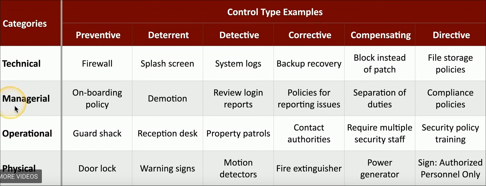
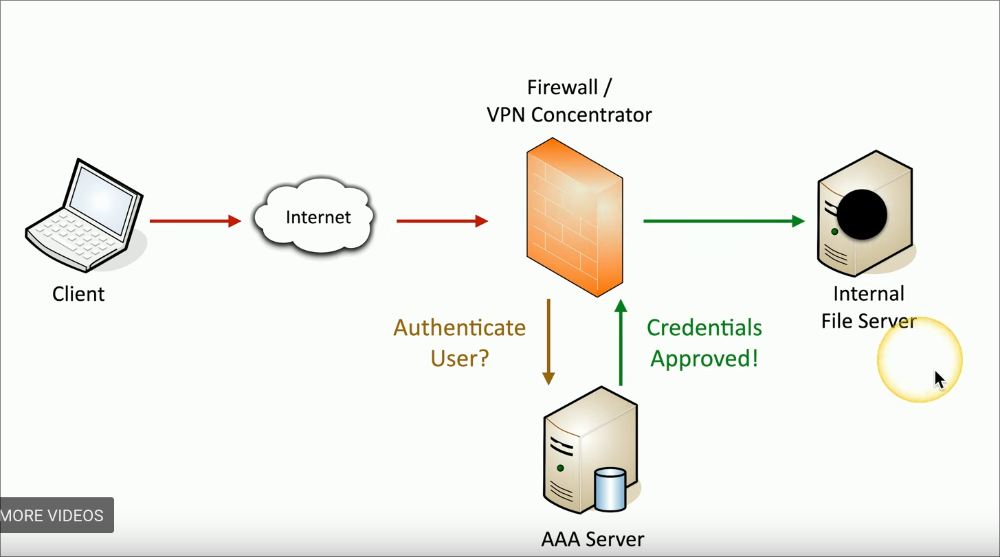
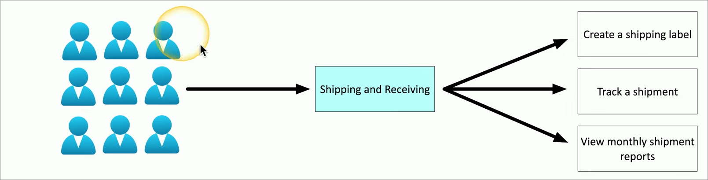
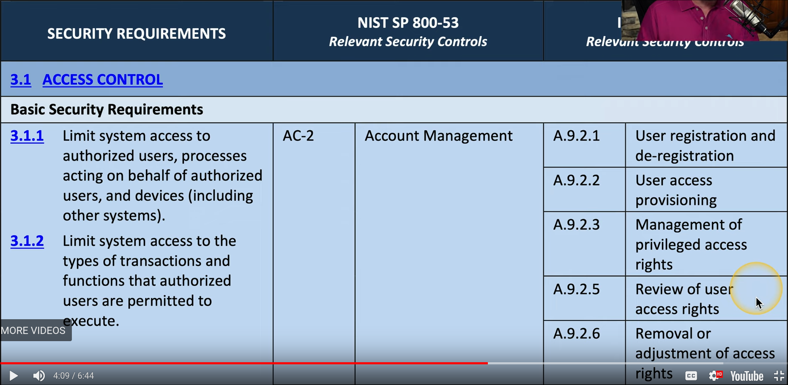
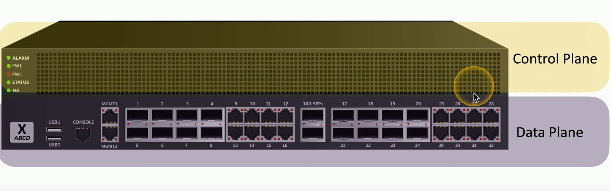
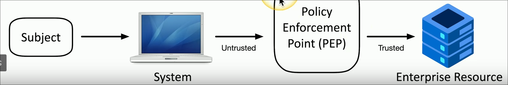
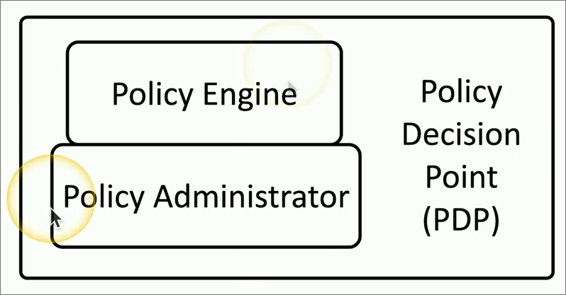
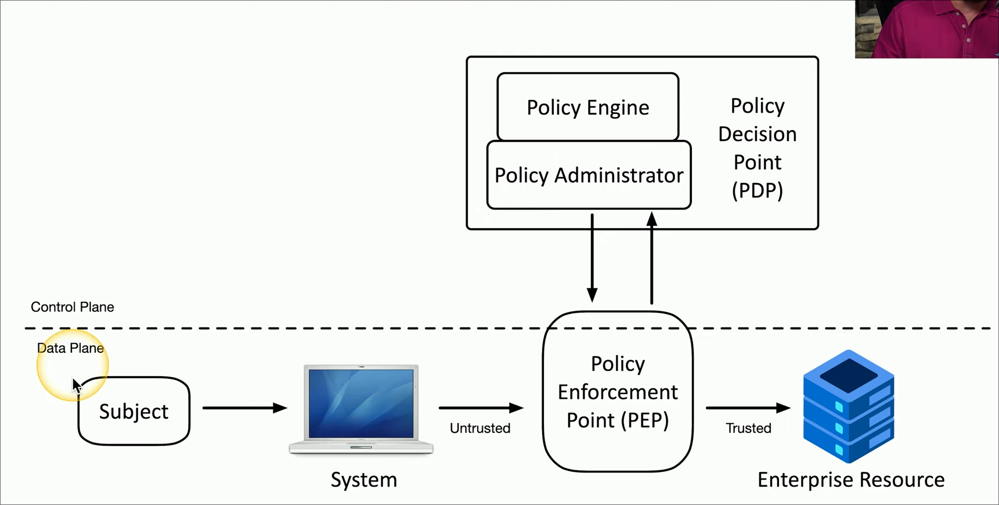
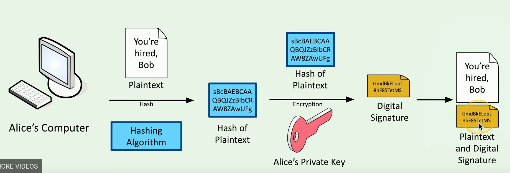

## Video 1.1.1: Security Controls #Security+
	- 
	- Security Risks
	- Assets
	- ### Preventative
	  background-color:: yellow
		- Technical Controls
			- Operating systems
			- Firewalls
			- Antivirus
			- Managerial Controls
				- Administrative controls with security design and implementation, these are telling your employees how to use a device securely and helping enforce that.
				- Day to Day aka procedural
			- Operational Controls
				- Controls implemented by people
				- example: Security Guards, awareness programs
			- Physical Controls
	- ### Deturrent #card
	  card-last-score:: 1
	  card-repeats:: 1
	  card-next-schedule:: 2024-12-29T15:00:00.000Z
	  background-color:: red
	  card-last-interval:: -1
	  card-ease-factor:: 2.5
	  card-last-reviewed:: 2024-12-29T04:13:12.771Z
		- Makes people second guess if they sould do what there about to do
			- Examples:
				- Splash Screen when logging into a system
				- Front reception desk
				- warning sighs
	- ### Detective #card
	  background-color:: pink
		- A way to log an attack, may not prevent or mitigate
			- Examples:
				- Login Reports
				- Regularly patrol an area
				- enable motion detectors
	- ### Corrective #card
	  background-color:: green
		- Apply a controller after the event has been enacted, this will mitigate the effects of the attack and create less downtime.
			- Examples:
				- Computer rollback
				- Contact law enforcement to manage criminal activity
				- use a fire extinguisher.
	- ### Compensating #card
	  background-color:: blue
		- Control using other means, exisitng controls are noty sufficent.
			- Examples:
				- Firewall blocks app with new vulnerability instead of patching the app
				- implement a separation of duties
				- More guards
				- Generator after power outage
	- ### Directive #card
	  background-color:: purple
		- Direct a subject towards security compliance, this is a weak security control.
		- Examples:
			- store all sensitive files in a protected folder
			- create a compliance policies and procedures
			- train users on proper security policies
			- post a sign for authorized personnel only
-
- # Video 1.2.1: CIA Triad
	- {:height 120, :width 133}
	- Easy way to remember the fundamentals of security
	- Also Known as the AIC Triad
	- ### CIA Triad #card
	  background-color:: yellow
		- Confidentiality: We need to keep the information Hidden
		- Integrity: Messages cant be modified without being detected
		- Availability: Systems and networks must be up and running
	- ### Confidentiality #card
	  background-color:: red
		- Certain information should only be known to certain people.
		- Encryption helps us do this but giving a key to decrypt to a certain person.
		- Access Controls
			- Selectively restrict access and resources  to certain people.
		- Two Factor Authentication.
	- ### Integrity #card
	  background-color:: pink
		- Data is stored and tresfered as intended
		- Hashing
		- Digital Signature
			- Takes a hash and encrypts it asymmetrically
		- Certificates
		- Non-repudiation
			- provides proof of integrity and origin.
	- ### Availability #card
	  background-color:: green
		- Always running
		- Fault tolerance
			- System will continue ti run even when failure occurs, redundant.
		- Patching
- # Video 1.2.2: AAA
	- AAA Framework #card
	  background-color:: yellow
		- Authentication #card
			- Prove you are who you say, identification
		- Authorization #card
			- Based on youre identification and authentificatio, what accsess do you have
		- Accounting #card
			- Resources used, when you logged, the data sent and received, logout time.
	- AAA Examples #card
	  background-color:: red
		- client connects to a the internet and to a vpn, the firewall will ask for the user and pass and will send them to a AAA Server which actually verifies the user and passes them through the firewall if approved.
		- {:height 180, :width 277}
	- Authenticate Devices
	  background-color:: pink
		- A computer needs to prove they are allowed to be on the network. We can do this with a certificate
		- CA #card
			- A certificate authority digitally sighs a certificate with the organizations CA
			- This certificate can now be included as part of the authentication method
	- Authorize a device #card
	  background-color:: green
		- Now that we have authenticated a device or user, we now put them into **groups** these groups will have a set of permissions, this makes it easy to scale permissions
		- {:height 191, :width 720}
		- Abstraction #card
			- Adding something in the middle, a user goes with a group
- # Video 1.2.3: Gap analysis
	- ### gap analysis #card
	  background-color:: red
		- is the gap between where you are and where you want to be
	- Comparison
	  background-color:: yellow
		- evaluate the existing systems
		- identify weaknesses in security or efficiency
	- {:height 146, :width 262}
	-
- # Video 1.2.4: Zero Trust
	- ### Zero Trust #card
	  background-color:: yellow
		- Covers every device, every process, every person. Trust no one authenticate at every resource.
	- Split the network into functional planes
		- Applies physical, virtual, and cloud components
	- ### Data Plane #card
	  background-color:: red
		- process the frames, packets, and network data
			- Switches
			- Firewall
			- Router
		- processing, forwarding, trunking, encrypting, NAT
	- ### Control Plane #card
	  background-color:: pink
		- Manages the actions of the data plane
		- settings polcies rules for what security a device needs to have
		- determines how packets sould be forwarded
		- routing tables, session tables, NAT tables
		- 
	- ### Adaptive identity #card
	  background-color:: green
		- Based on the authentication **data**, like where the user is what role they play like ceo or regular employee and what data they are trying to access.
	- ### Threat scope reduction #card
	  background-color:: red
		- reducing the entry points into a network
	- ### Policy-driven access control #card
	  background-color:: blue
		- combine **adaptive identity** and a **predefined set of rules** based on the adaptive identity data.
	- ### PEP #card
	  background-color:: yellow
		- Policy Enforcement Point
		- This is the point where users and devices will be evaluated and data will be collected. It does now enforce any security measures, it passes this information to the **PDP**.
		- 
	- ### PDP #card
	  background-color:: red
		- Policy Decision Point
		- This takes the data from the **PEP** and enforces a set of predefined security measures.
		- {:height 232, :width 410}
	- ### Policy Engine #card
	  background-color:: green
		- Evaulutaes each access decision based on policy and other information sources
		- Grant, Deny, or Revoke
	- ### Policy Administrator #card
	  background-color:: blue
		- communicates with the polocy Enforcement Point
		- Generates access tokens or credentials
		- Tells the **PEP** to allow or disallow access
	- {:height 387, :width 750}
-
- # Video 1.2.5: Physical Security
	- ### Barricades or Bollards
	  background-color:: yellow
		- Channel people through a specific access point only allow people and prevent cars and trucks
	- ### Access control vestibules
	  background-color:: red
		- Air lock, One at a time.
	- ### Fence
	  background-color:: pink
		- Build a perimeter see through or not
	- ### CCTV
	  background-color:: green
		- Replaces physical Guards
		- Closed Circuit Television
	- ### Security Gaurd
	  background-color:: blue
		- Physical protection at the reception or permemter
	- ### ID
	  background-color:: purple
		- This I a identification
	- ### Light
	  background-color:: yellow
		- More security will illuminate the persons face
		- Avoid Shadow and glares
	- ### Inferred
	  background-color:: red
		- Detects infered radiation in both light and dark
		- Common in motion detectors
	- ### Microwave
	  background-color:: pink
		- For more area motion detection
- # Video 1.2.6: Deception and Disruption
	- ### Honey Pot #card
	  background-color:: yellow
		- attract bad guys are trap them
		- This will allow you to see what they are trying to attack and how
	- ### Honey Nets
	  background-color:: red
		- a network of honeypots
		- more believable
	- ### Honey Files #card
	  background-color:: pink
		- These are files that have fake infomration
		- You can even add traceable information and track what and where the attacker uses this fake information
	- ### Honey Tokens #card
	  background-color:: green
		- fake AP I tokens where you can trace where they are used
	- ### Honey Emails #card
	  background-color:: blue
		- Fake Email addresses
- # Video 1.2.7: Non-repudiation
	- ### Proof of integrity #card
	  background-color:: yellow
		- Make sure the data does not change
		- often a hash is used
		- A hash is often compared to a fingerprint
		- Hash does not say who sent the data
	- ### Proof of origin #card
	  background-color:: red
		- Verify who sent the data
		- authentication
		- Digital signature
			- This is a private key where only the sender knows, it can be verified with a public key.
		- 