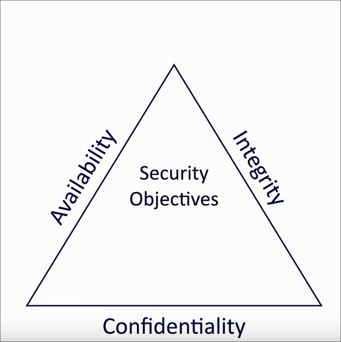

## Video 1.1.1: Security Controls #Security+
	- 
	- Security Risks
	- Assets
	- ### Preventative
	  background-color:: yellow
		- Technical Controls
			- Operating systems
			- Firewalls
			- Antivirus
			- Managerial Controls
				- Administrative controls with security design and implementation, these are telling your employees how to use a device securely and helping enforce that.
				- Day to Day aka procedural
			- Operational Controls
				- Controls implemented by people
				- example: Security Guards, awareness programs
			- Physical Controls
	- ### Deturrent #card
	  card-last-score:: 1
	  card-repeats:: 1
	  card-next-schedule:: 2024-12-29T15:00:00.000Z
	  background-color:: red
	  card-last-interval:: -1
	  card-ease-factor:: 2.5
	  card-last-reviewed:: 2024-12-29T04:13:12.771Z
		- Makes people second guess if they sould do what there about to do
			- Examples:
				- Splash Screen when logging into a system
				- Front reception desk
				- warning sighs
	- ### Detective #card
	  background-color:: pink
		- A way to log an attack, may not prevent or mitigate
			- Examples:
				- Login Reports
				- Regularly patrol an area
				- enable motion detectors
	- ### Corrective #card
	  background-color:: green
		- Apply a controller after the event has been enacted, this will mitigate the effects of the attack and create less downtime.
			- Examples:
				- Computer rollback
				- Contact law enforcement to manage criminal activity
				- use a fire extinguisher.
	- ### Compensating #card
	  background-color:: blue
		- Control using other means, exisitng controls are noty sufficent.
			- Examples:
				- Firewall blocks app with new vulnerability instead of patching the app
				- implement a separation of duties
				- More guards
				- Generator after power outage
	- ### Directive #card
	  background-color:: purple
		- Direct a subject towards security compliance, this is a weak security control.
		- Examples:
			- store all sensitive files in a protected folder
			- create a compliance policies and procedures
			- train users on proper security policies
			- post a sign for authorized personnel only
-
- # Video 1.2.1: CIA Triad
	- {:height 120, :width 133}
	- Easy way to remember the fundamentals of security
	- Also Known as the AIC Triad
	- ### CIA Triad #card
	  background-color:: yellow
		- Confidentiality: We need to keep the information Hidden
		- Integrity: Messages cant be modified without being detected
		- Availability: Systems and networks must be up and running
	- ### Confidentiality #card
	  background-color:: red
		- Certain information should only be known to certain people.
		- Encryption helps us do this but giving a key to decrypt to a certain person.
		- Access Controls
			- Selectively restrict access and resources  to certain people.
		- Two Factor Authentication.
	- ### Integrity #card
	  background-color:: pink
		- Data is stored and tresfered as intended
		- Hashing
		- Digital Signature
			- Takes a hash and encrypts it asymmetrically
		- Certificates
		- Non-repudiation
			- provides proof of integrity and origin.
	- ### Availability #card
	  background-color:: green
		- Always running
		- Fault tolerance
			- System will continue ti run even when failure occurs, redundant.
		- Patching
- # Video 1.2.2: AAA
	- AAA Framework #card
	  background-color:: yellow
		- Authentication #card
			- Prove you are who you say, identification
		- Authorization #card
			- Based on youre identification and authentificatio, what accsess do you have
		- Accounting #card
			- Resources used, when you logged, the data sent and received, logout time.
	- AAA Examples #card
	  background-color:: red
		- client connects to a the internet and to a vpn, the firewall will ask for the user and pass and will send them to a AAA Server which actually verifies the user and passes them through the firewall if approved.
		- {:height 180, :width 277}
	- Authenticate Devices
	  background-color:: pink
		- A computer needs to prove they are allowed to be on the network. We can do this with a certificate
		- CA #card
			- A certificate authority digitally sighs a certificate with the organizations CA
			- This certificate can now be included as part of the authentication method
	- Authorize a device #card
	  background-color:: green
		- Now that we have authenticated a device or user, we now put them into **groups** these groups will have a set of permissions, this makes it easy to scale permissions
		- {:height 191, :width 720}
		- Abstraction #card
			- Adding something in the middle, a user goes with a group
- # Video 1.2.3: Gap analysis
	- ### gap analysis
	  background-color:: red
		- is the gap between where you are and where you want to be
	- Comparison
	  background-color:: yellow
		- evaluate the existing systems
		- identify weaknesses in security or efficiency
	- {:height 146, :width 262}
	-