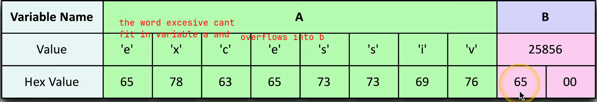
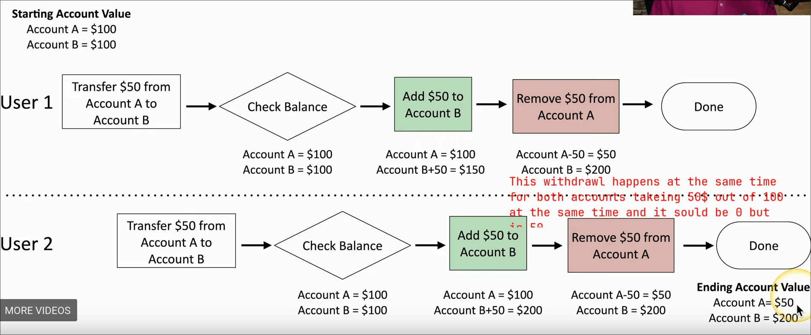
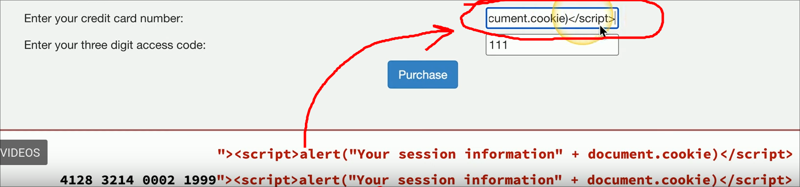
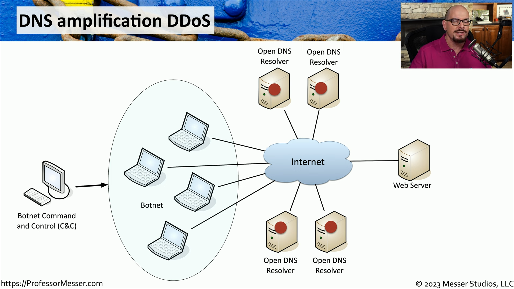

# Video 2.1.1 Threat Actors #Security+
	- ### Threat Actor #card
	  background-color:: yellow
	  card-last-interval:: 11.61
	  card-repeats:: 1
	  card-ease-factor:: 2.6
	  card-next-schedule:: 2025-01-26T03:00:38.958Z
	  card-last-reviewed:: 2025-01-14T13:00:38.959Z
	  card-last-score:: 5
		- A person that have an effect on safety
		- Atributes
			- Internal
			- External
			- Resources/Funding
			- Level of sophistication
	- ### Nation State #card
	  background-color:: red
	  card-last-interval:: 11.61
	  card-repeats:: 1
	  card-ease-factor:: 2.6
	  card-next-schedule:: 2025-01-26T02:57:06.110Z
	  card-last-reviewed:: 2025-01-14T12:57:06.110Z
	  card-last-score:: 5
		- external entity
		- goverment
		- Motives
			- data exfiltration
			- philosophical
			- revenge
			- disruption
			- war
		- APT
		- High Sophistication
			- they work with a government
	- ### APT #card
	  background-color:: pink
	  card-last-interval:: 11.61
	  card-repeats:: 1
	  card-ease-factor:: 2.6
	  card-next-schedule:: 2025-01-26T02:55:52.440Z
	  card-last-reviewed:: 2025-01-14T12:55:52.441Z
	  card-last-score:: 5
		- Advanced Persistent Threat
			- They don't really know what they are doing
			- Motives
				- disruption
				- data
				- something philosophical
			- internal or external
			- limited resources
	- ### Hacktivist #card
	  background-color:: green
	  card-last-interval:: 11.61
	  card-repeats:: 1
	  card-ease-factor:: 2.6
	  card-next-schedule:: 2025-01-26T02:56:50.132Z
	  card-last-reviewed:: 2025-01-14T12:56:50.132Z
	  card-last-score:: 5
		- a hacker with a purpose
		- external
		- sophisticated
		- Motives
			- DoS
			- website defacing
			- private document
	- ### Insider threat #card
	  background-color:: blue
	  card-last-interval:: 11.61
	  card-repeats:: 1
	  card-ease-factor:: 2.6
	  card-next-schedule:: 2025-01-26T02:58:26.846Z
	  card-last-reviewed:: 2025-01-14T12:58:26.846Z
	  card-last-score:: 5
		- motivated by revenge and finacial gain
		- using the orginizations resources against themselves
		- internal
	- ### Organized crime #card
	  background-color:: purple
	  card-last-interval:: 11.61
	  card-repeats:: 1
	  card-ease-factor:: 2.6
	  card-next-schedule:: 2025-01-26T02:57:37.358Z
	  card-last-reviewed:: 2025-01-14T12:57:37.358Z
	  card-last-score:: 5
		- profesional criminals
		- motivated by money
		- very soophisticated
		- Organized/ multiple people with their own job
		- lots of funding
	- ### Shadow IT #card
	  background-color:: pink
	  card-last-interval:: 11.61
	  card-repeats:: 1
	  card-ease-factor:: 2.6
	  card-next-schedule:: 2025-01-26T03:00:00.109Z
	  card-last-reviewed:: 2025-01-14T13:00:00.109Z
	  card-last-score:: 5
		- working arounf the inernal it orginization builds their own infastructure
		- they put own roadblocks
		- limited budget
		- medium sophistication
- # Video 2.2.1 Common Threat Vectors
	- ### Message based vectors #card
	  background-color:: yellow
	  card-last-interval:: 11.61
	  card-repeats:: 1
	  card-ease-factor:: 2.6
	  card-next-schedule:: 2025-01-26T02:59:19.434Z
	  card-last-reviewed:: 2025-01-14T12:59:19.435Z
	  card-last-score:: 5
		- vulnerability in email
		- malicious links
		- Phishing attacks
		- SMS
	- ### Image-based vectors #card
	  background-color:: red
	  card-last-interval:: 11.61
	  card-repeats:: 1
	  card-ease-factor:: 2.6
	  card-next-schedule:: 2025-01-26T02:57:32.977Z
	  card-last-reviewed:: 2025-01-14T12:57:32.977Z
	  card-last-score:: 5
		- SVG  Scaleable vector graphic
			- it can contain code that gets executed by youre browser
			- HTML Injection through xml from a svg
	- ### File Based vectors #card
	  background-color:: green
	  card-last-interval:: 11.61
	  card-repeats:: 1
	  card-ease-factor:: 2.6
	  card-next-schedule:: 2025-01-26T02:58:03.043Z
	  card-last-reviewed:: 2025-01-14T12:58:03.043Z
	  card-last-score:: 5
		- PDF
			- a file containing other objects
		- ZIP/RAR
			- contains many files within it
		- Microsoft office
			- documents with macros
			- add-in files
	- ### Vishing based vectors #card
	  background-color:: pink
	  card-last-interval:: 11.61
	  card-repeats:: 1
	  card-ease-factor:: 2.6
	  card-next-schedule:: 2025-01-26T02:59:15.249Z
	  card-last-reviewed:: 2025-01-14T12:59:15.249Z
	  card-last-score:: 5
		- phishing over the phone to get personal information over phone
	- ### Removable device based vectors #card
	  background-color:: green
	  card-last-interval:: 11.61
	  card-repeats:: 1
	  card-ease-factor:: 2.6
	  card-next-schedule:: 2025-01-26T03:00:38.046Z
	  card-last-reviewed:: 2025-01-14T13:00:38.046Z
	  card-last-score:: 5
		- get arond the firewall
		- is malicious software on a usb software
		- usb drives can act as a keyboard
	- ### Vulnerable software vectores #card
	  background-color:: blue
	  card-last-interval:: 11.61
	  card-repeats:: 1
	  card-ease-factor:: 2.6
	  card-next-schedule:: 2025-01-26T02:58:25.210Z
	  card-last-reviewed:: 2025-01-14T12:58:25.210Z
	  card-last-score:: 5
		- infected executable
		- known or unknown vulnerabilities in software
		- agent-less apps stuff from a browser or central server
	- ### Unsupported system vectors #card
	  background-color:: green
	  card-last-interval:: 11.61
	  card-repeats:: 1
	  card-ease-factor:: 2.6
	  card-next-schedule:: 2025-01-26T02:58:16.527Z
	  card-last-reviewed:: 2025-01-14T12:58:16.531Z
	  card-last-score:: 5
		- pathcing device is no longer a option
		- stuck on old cruddy software with vulnerabilities
		- IT might not know the device exists
	- ### Insecure network vectors #card
	  background-color:: blue
	  card-last-interval:: 11.61
	  card-repeats:: 1
	  card-ease-factor:: 2.6
	  card-next-schedule:: 2025-01-26T03:00:45.326Z
	  card-last-reviewed:: 2025-01-14T13:00:45.327Z
	  card-last-score:: 5
		- wireless, use WPA3
		- unsecure interfaces
			- 802.1x to lock down ports
		- Bluetooth
	- ### Open services ports #card
	  background-color:: red
	  card-last-interval:: 11.61
	  card-repeats:: 1
	  card-ease-factor:: 2.6
	  card-next-schedule:: 2025-01-26T02:56:47.913Z
	  card-last-reviewed:: 2025-01-14T12:56:47.914Z
	  card-last-score:: 5
		- most network based attacks
		- every open port is a vulnerability
		- keep firewall rules tight
	- ### Default Credentials
	  background-color:: red
	- ### Supply Chain Vectors #card
	  background-color:: purple
	  card-last-interval:: 11.61
	  card-repeats:: 1
	  card-ease-factor:: 2.6
	  card-next-schedule:: 2025-01-26T03:00:58.061Z
	  card-last-reviewed:: 2025-01-14T13:00:58.062Z
	  card-last-score:: 5
		- Tamper with underlying infrastructure
		- MSPs
		- Vulnerability in a Cisco device
	- ### MSP #card
	  background-color:: blue
	  card-last-interval:: 11.61
	  card-repeats:: 1
	  card-ease-factor:: 2.6
	  card-next-schedule:: 2025-01-26T03:01:01.496Z
	  card-last-reviewed:: 2025-01-14T13:01:01.496Z
	  card-last-score:: 5
		- Managed service providers
		- access different costumers networks from a central location
- # Video 2.2.2 Phishing
	-
- # Video 2.2.3 Impersonation
	- ### Impersonation #card
	  background-color:: red
	  card-last-interval:: 11.61
	  card-repeats:: 1
	  card-ease-factor:: 2.6
	  card-next-schedule:: 2025-01-26T02:56:01.993Z
	  card-last-reviewed:: 2025-01-14T12:56:01.994Z
	  card-last-score:: 5
		- bad spelling, too good of a deal, out of no where.
		- They can use personal information to get some sort of trust
- # Video 2.2.4 Watering Hole Attacks
	- ### Watering hole attack #card
	  background-color:: pink
	  card-last-interval:: 11.61
	  card-repeats:: 1
	  card-ease-factor:: 2.6
	  card-next-schedule:: 2025-01-26T03:00:29.906Z
	  card-last-reviewed:: 2025-01-14T13:00:29.907Z
	  card-last-score:: 5
		- A attacker will poison the source where people will come to
		- infect a website that the users use with any type of attack including social networking
		- **You can prevent this by having a IPS monitor traffic that the firewall let in**
- # Video 2.2.5 Other types of social engineering attacks
	- ### Misinformation/disinformation #card
	  background-color:: red
	  card-last-interval:: 11.61
	  card-repeats:: 1
	  card-ease-factor:: 2.6
	  card-next-schedule:: 2025-01-26T02:58:21.458Z
	  card-last-reviewed:: 2025-01-14T12:58:21.459Z
	  card-last-score:: 5
		- create confusion and division
		- influence campaigns #card
		  card-last-interval:: 11.61
		  card-repeats:: 1
		  card-ease-factor:: 2.6
		  card-next-schedule:: 2025-01-26T02:56:10.310Z
		  card-last-reviewed:: 2025-01-14T12:56:10.311Z
		  card-last-score:: 5
			- sway public opinions
			- social media and advertising
		- Nation state actors #card
		  card-last-interval:: -1
		  card-repeats:: 1
		  card-ease-factor:: 2.5
		  card-next-schedule:: 2025-01-14T15:00:00.000Z
		  card-last-reviewed:: 2025-01-14T12:57:26.924Z
		  card-last-score:: 1
			- divide distract and persuade
		- Brand Impersonation
- # Video 2.3.1 Memory Injections
	- ### Memory injection #card
	  background-color:: yellow
	  card-last-interval:: 11.61
	  card-repeats:: 1
	  card-ease-factor:: 2.6
	  card-next-schedule:: 2025-01-26T03:00:31.644Z
	  card-last-reviewed:: 2025-01-14T13:00:31.644Z
	  card-last-score:: 5
		- add code into memory
		- hide malware in process
			- gives the malware the same permission as the process it hides in
		- DLL is a windows process
	- ### DLL #card
	  background-color:: red
	  card-last-interval:: 11.61
	  card-repeats:: 1
	  card-ease-factor:: 2.6
	  card-next-schedule:: 2025-01-26T02:55:42.966Z
	  card-last-reviewed:: 2025-01-14T12:55:42.966Z
	  card-last-score:: 5
		- Dynamic Link Library\
- # Video 2.3.2 Buffer Overflows
	- ### Buffer overflow attack #card
	  background-color:: red
	  card-last-interval:: 11.61
	  card-repeats:: 1
	  card-ease-factor:: 2.6
	  card-next-schedule:: 2025-01-26T03:00:30.916Z
	  card-last-reviewed:: 2025-01-14T13:00:30.917Z
	  card-last-score:: 5
		- overwriting a buffer of memory spills into other parts of a applications memoery
		- not simple
		- Sometimes does nothing
		- 
- # Video 2.3.3 Race Conditions
	- ### Race Conditions #card
	  background-color:: green
	  card-last-interval:: 11.61
	  card-repeats:: 1
	  card-ease-factor:: 2.6
	  card-next-schedule:: 2025-01-26T02:57:20.942Z
	  card-last-reviewed:: 2025-01-14T12:57:20.943Z
	  card-last-score:: 5
		- When something happens at the same time and the program may not know it
	- ### TOCTOU #card
	  background-color:: red
	  card-last-interval:: -1
	  card-repeats:: 1
	  card-ease-factor:: 2.5
	  card-next-schedule:: 2025-01-14T15:00:00.000Z
	  card-last-reviewed:: 2025-01-14T12:59:58.131Z
	  card-last-score:: 1
		- Time of use attack
		- something that happens in between storing and running information
		- Its a race condition
		- {:height 231, :width 466}
- # Video 2.3.4 Malicious Updates
	- ### Best Practive when updating #card
	  background-color:: pink
	  card-last-interval:: 11.61
	  card-repeats:: 1
	  card-ease-factor:: 2.6
	  card-next-schedule:: 2025-01-26T03:00:52.502Z
	  card-last-reviewed:: 2025-01-14T13:00:52.503Z
	  card-last-score:: 5
		- Keep backup
		- verify source
		- make sure their are no bugs or new vulnerabilities
- # Video 2.3.5 Operating Systems
	- An operating system is a common place to look for vulnerabilities as they are very complex #card
	  background-color:: pink
	  card-last-interval:: 11.61
	  card-repeats:: 1
	  card-ease-factor:: 2.6
	  card-next-schedule:: 2025-01-26T02:59:07.543Z
	  card-last-reviewed:: 2025-01-14T12:59:07.544Z
	  card-last-score:: 5
		- They get patched frequently
- # Video 2.3.6 SQL Injection
	- ### SQL Injection #card
	  background-color:: red
	  card-last-interval:: 11.61
	  card-repeats:: 1
	  card-ease-factor:: 2.6
	  card-next-schedule:: 2025-01-26T03:01:03.510Z
	  card-last-reviewed:: 2025-01-14T13:01:03.510Z
	  card-last-score:: 5
		- a common version of code injection where code is put into a database and the code will end up running it when it was just supposed to be something like a username.
		- 
		- Instead of getting a simple username you get every username
- # Video 2.3.7 Cross Site Scripting
	- ### XSS #card
	  background-color:: yellow
	  card-last-interval:: 11.61
	  card-repeats:: 1
	  card-ease-factor:: 2.6
	  card-next-schedule:: 2025-01-26T02:58:41.431Z
	  card-last-reviewed:: 2025-01-14T12:58:41.431Z
	  card-last-score:: 5
		- Cross-site scripting
		- Originally called cross-site because of browser security flaws
		- one of the most common web based vulnerabilities
	- ### Non-persistant/reflected XSS attack #card
	  background-color:: red
	  card-last-interval:: -1
	  card-repeats:: 1
	  card-ease-factor:: 2.5
	  card-next-schedule:: 2025-01-14T15:00:00.000Z
	  card-last-reviewed:: 2025-01-14T12:58:53.277Z
	  card-last-score:: 1
		- search box is a common source
		- attacker runs script that sends credentials/session IDs to the attacker
		- 
	- ### Persistent (Stored) XSS attack #card
	  background-color:: pink
	  card-last-interval:: -1
	  card-repeats:: 1
	  card-ease-factor:: 2.5
	  card-next-schedule:: 2025-01-14T15:00:00.000Z
	  card-last-reviewed:: 2025-01-14T12:59:02.263Z
	  card-last-score:: 1
		- attacker posts a malicouse payload to a social network
		- is persistent as everyone gets the payload
		- attacks anyone who visits the site
		- spreads
- # Video 2.3.8 Hardware vulnerabilities
	- ### Hardware devices #card
	  background-color:: yellow
	  card-last-interval:: 11.61
	  card-repeats:: 1
	  card-ease-factor:: 2.6
	  card-next-schedule:: 2025-01-26T02:57:46.810Z
	  card-last-reviewed:: 2025-01-14T12:57:46.810Z
	  card-last-score:: 5
		- dont have a OS or we dont have access to it like IOT
		  :LOGBOOK:
		  CLOCK: [2025-01-09 Thu 14:37:58]
		  :END:
		- Firmware the only people who can manage or update the system are the manufactures
	- ### EOL #card
	  background-color:: blue
	  card-last-interval:: 11.61
	  card-repeats:: 1
	  card-ease-factor:: 2.6
	  card-next-schedule:: 2025-01-26T02:57:09.892Z
	  card-last-reviewed:: 2025-01-14T12:57:09.893Z
	  card-last-score:: 5
		- End of life
		- in the future they will stop selling the device but security patches will be applied
	- ### EOSL #card
	  background-color:: red
	  card-last-interval:: 11.61
	  card-repeats:: 1
	  card-ease-factor:: 2.6
	  card-next-schedule:: 2025-01-26T03:00:33.629Z
	  card-last-reviewed:: 2025-01-14T13:00:33.630Z
	  card-last-score:: 5
		- End of service life
		- end of security patches
- # Video 2.3.9 Virtualization vulnerabilities
	- Quantity of resources between vms
	- complexity adds opportunities to physical machines
	- ### Virtual machine escape #card
	  background-color:: yellow
	  card-last-interval:: 11.61
	  card-repeats:: 1
	  card-ease-factor:: 2.6
	  card-next-schedule:: 2025-01-26T03:00:01.881Z
	  card-last-reviewed:: 2025-01-14T13:00:01.881Z
	  card-last-score:: 5
		- attacker can get into one machine and escape it to get to other vms on the hypervisor
		- you can have great control
	- ### Resource Reuse #card
	  background-color:: pink
	  card-last-interval:: 11.61
	  card-repeats:: 1
	  card-ease-factor:: 2.6
	  card-next-schedule:: 2025-01-26T02:59:53.225Z
	  card-last-reviewed:: 2025-01-14T12:59:53.226Z
	  card-last-score:: 5
		- the hypervisor manages the relationship between the phyiscal and virtual resoureces
		- Ram is shared between the vms on a hypervisor
		- memory areas shared between the vms
- # Video 2.3.10 cloud vulnerabilities
	- Cloud adoption has been nearly universal
	- ### DoS
	  background-color:: yellow
		- Denial of service one device
		- Overload a service
		- remove competetor from market
		- can be a smoke screen
		- Turn off power is easy example of this
		- can be self inflicted
	- ### DDoS #card
	  background-color:: red
	  card-last-interval:: 11.61
	  card-repeats:: 1
	  card-ease-factor:: 2.6
	  card-next-schedule:: 2025-01-26T02:57:52.342Z
	  card-last-reviewed:: 2025-01-14T12:57:52.342Z
	  card-last-score:: 5
		- Distributed denial of service is done by many different devices
		- Use multiple bandwidths to overload a service or sites
		- Bot nets are used to execute these
		- Reflecting and amplifying packets by sending small packets and requesting a lot of data like a Ping
		- 
		-
	- ### Directory traversal #card
	  background-color:: green
	  card-last-interval:: 11.61
	  card-repeats:: 1
	  card-ease-factor:: 2.6
	  card-next-schedule:: 2025-01-26T03:00:36.046Z
	  card-last-reviewed:: 2025-01-14T13:00:36.047Z
	  card-last-score:: 5
		- being able to move around a file system
	- ### Out of bounds write #card
	  background-color:: purple
	  card-last-interval:: 11.61
	  card-repeats:: 1
	  card-ease-factor:: 2.6
	  card-next-schedule:: 2025-01-26T02:59:51.076Z
	  card-last-reviewed:: 2025-01-14T12:59:51.076Z
	  card-last-score:: 5
		- when a attacker is able to write into unauthorized memory areas
- # Video 2.3.11 Supply chain vulnerabilities
	- When a specific product or thing is on the same network and creates a attack vector
	- Dont trust just any product use a trusted supplier and even so make sure that you treat the device as a vulnerability.
- # video 2.3.12
	- ### Open Permission #card
	  background-color:: red
	  card-last-interval:: 11.61
	  card-repeats:: 1
	  card-ease-factor:: 2.6
	  card-next-schedule:: 2025-01-26T03:00:28.459Z
	  card-last-reviewed:: 2025-01-14T13:00:28.460Z
	  card-last-score:: 5
		- very easy to leave a door open
		- increasingly common with cloud storage
		- Verizon left a huge amount of data open
	- ### Unsecured admin account #card
	  background-color:: green
	  card-last-interval:: 11.61
	  card-repeats:: 1
	  card-ease-factor:: 2.6
	  card-next-schedule:: 2025-01-26T02:58:29.074Z
	  card-last-reviewed:: 2025-01-14T12:58:29.075Z
	  card-last-score:: 5
		- shit passwords
	- ### Insecure protocols #card
	  background-color:: purple
	  card-last-interval:: 11.61
	  card-repeats:: 1
	  card-ease-factor:: 2.6
	  card-next-schedule:: 2025-01-26T03:00:23.010Z
	  card-last-reviewed:: 2025-01-14T13:00:23.011Z
	  card-last-score:: 5
		- telnet
		- ftp
		- smtp
		- imap
		- You can do a packet capture to check data
- # Video 2.3.14 Mobile device vulnerabilities
	- ### Mobile device #card
	  background-color:: yellow
	  card-last-interval:: 11.61
	  card-repeats:: 1
	  card-ease-factor:: 2.6
	  card-next-schedule:: 2025-01-26T02:59:04.065Z
	  card-last-reviewed:: 2025-01-14T12:59:04.066Z
	  card-last-score:: 5
		- not easy to secure
		- hard to know where it is
		- packed with personal information
- # Video 2.3.15 Zero day vulnerabilities
	- ### Zero Day Vulnerability #card
	  background-color:: red
	  card-last-interval:: 11.61
	  card-repeats:: 1
	  card-ease-factor:: 2.6
	  card-next-schedule:: 2025-01-26T03:00:34.730Z
	  card-last-reviewed:: 2025-01-14T13:00:34.731Z
	  card-last-score:: 5
		- A vulnerability that has to be patched or will be patched immediately as its a huge security risk
- # Video 2.4.1 Overview of malware
	- Different types of malware will work together to attack computer
- # Video 2.4.2 Viruses and Worms
	- ### Program Virus #card
	  background-color:: yellow
	  card-last-interval:: 11.61
	  card-repeats:: 1
	  card-ease-factor:: 2.6
	  card-next-schedule:: 2025-01-26T02:59:17.852Z
	  card-last-reviewed:: 2025-01-14T12:59:17.853Z
	  card-last-score:: 5
		- its part of application
	- ### Boot sector virus #card
	  background-color:: red
	  card-last-interval:: 11.61
	  card-repeats:: 1
	  card-ease-factor:: 2.6
	  card-next-schedule:: 2025-01-26T02:57:41.058Z
	  card-last-reviewed:: 2025-01-14T12:57:41.059Z
	  card-last-score:: 5
		- in the boot sector of the os
	- ### Script Virus #card
	  background-color:: green
	  card-last-interval:: 11.61
	  card-repeats:: 1
	  card-ease-factor:: 2.6
	  card-next-schedule:: 2025-01-26T02:58:20.041Z
	  card-last-reviewed:: 2025-01-14T12:58:20.042Z
	  card-last-score:: 5
		- A virus using scripts
	- ### Macro virus #card
	  background-color:: purple
	  card-last-interval:: 11.61
	  card-repeats:: 1
	  card-ease-factor:: 2.6
	  card-next-schedule:: 2025-01-26T02:59:43.023Z
	  card-last-reviewed:: 2025-01-14T12:59:43.024Z
	  card-last-score:: 5
		- common in ms office
	- ### File-less virus #card
	  background-color:: red
	  card-last-interval:: 11.61
	  card-repeats:: 1
	  card-ease-factor:: 2.6
	  card-next-schedule:: 2025-01-26T02:59:32.792Z
	  card-last-reviewed:: 2025-01-14T12:59:32.793Z
	  card-last-score:: 5
		- Does a good job avoiding AV
		- Operates only in memory
	- ### Worms #card
	  background-color:: green
	  card-last-interval:: 11.61
	  card-repeats:: 1
	  card-ease-factor:: 2.6
	  card-next-schedule:: 2025-01-26T02:59:21.292Z
	  card-last-reviewed:: 2025-01-14T12:59:21.293Z
	  card-last-score:: 5
		- they dont need user intervention
		- They move very fast
		- Firewalls and IDS/IPS can stop them most times
- # Video 2.4.3 Spyware and Bloatware
	- ### Spyware #card
	  background-color:: red
	  card-last-interval:: 11.61
	  card-repeats:: 1
	  card-ease-factor:: 2.6
	  card-next-schedule:: 2025-01-26T03:01:04.435Z
	  card-last-reviewed:: 2025-01-14T13:01:04.436Z
	  card-last-score:: 5
		- Malware that spy's on you advertise preforms identity theft affiliate fraud
		- Can trick you into installing software
		- watch everything you do
		- keylogs
		- Spyware can be very hard to remove
	- ### Bloatware #card
	  background-color:: green
	  card-last-interval:: 11.61
	  card-repeats:: 1
	  card-ease-factor:: 2.6
	  card-next-schedule:: 2025-01-26T02:57:11.474Z
	  card-last-reviewed:: 2025-01-14T12:57:11.475Z
	  card-last-score:: 5
		- apps included that you dont expect on a new device
		- uses space
		- the system may be running the apps in the background and have a vulnerability
		- Can be hard to remove third party uninstallers may be needed
- # Video 2.4.4 Other Malware Types
	- ### Key-loggers #card
	  background-color:: yellow
	  card-last-interval:: 11.61
	  card-repeats:: 1
	  card-ease-factor:: 2.6
	  card-next-schedule:: 2025-01-26T02:57:07.896Z
	  card-last-reviewed:: 2025-01-14T12:57:07.897Z
	  card-last-score:: 5
		- They log your keyboard presses
	- ### Logic Bomb #card
	  background-color:: red
	  card-last-interval:: 11.61
	  card-repeats:: 1
	  card-ease-factor:: 2.6
	  card-next-schedule:: 2025-01-26T02:59:49.564Z
	  card-last-reviewed:: 2025-01-14T12:59:49.564Z
	  card-last-score:: 5
		- waits for a predefined event
		- usually left by someone with a grudge
		- Difficult to recover and kills the system
	- ### Root Kit #card
	  background-color:: green
	  card-last-interval:: 11.61
	  card-repeats:: 1
	  card-ease-factor:: 2.6
	  card-next-schedule:: 2025-01-26T02:59:10.749Z
	  card-last-reviewed:: 2025-01-14T12:59:10.749Z
	  card-last-score:: 5
		- hides itself in the kernel of the OS hard to find
		- running as part of the os wont show asa process
		- root kit removal tools
		- secure boot will check the OS signature to make sure no kernel has been modified
	-
- # Video 2.4.5 Physical Attacks
	- Lock the doors and stuff goofy
- # Video 2.4.6 Denial of Service
	- look up goober
	-
- # Video 2.4.7 DNS Attacks
	- ### DNS Poisoning / spoofing #card
	  background-color:: yellow
	  card-last-interval:: 11.61
	  card-repeats:: 1
	  card-ease-factor:: 2.6
	  card-next-schedule:: 2025-01-26T03:00:47.376Z
	  card-last-reviewed:: 2025-01-14T13:00:47.377Z
	  card-last-score:: 5
		- Pretty tricky to complete
		- Edits the Domain names and the IP addresses they point to
		- can be done on a  dns server the client or a middle man
	- ### Domain Hijacking #card
	  background-color:: green
	  card-last-interval:: 11.61
	  card-repeats:: 1
	  card-ease-factor:: 2.6
	  card-next-schedule:: 2025-01-26T02:59:35.252Z
	  card-last-reviewed:: 2025-01-14T12:59:35.252Z
	  card-last-score:: 5
		- Dont need the actual servers just the domain name
		- Modified through the account that manages or owns the domain name like a cloudflare account
		- can be gotten by social engineering brute force etc.
	- ### URL Hijacking #card
	  background-color:: pink
	  card-last-interval:: 11.61
	  card-repeats:: 1
	  card-ease-factor:: 2.6
	  card-next-schedule:: 2025-01-26T02:59:09.352Z
	  card-last-reviewed:: 2025-01-14T12:59:09.352Z
	  card-last-score:: 5
		- redirect users that produce advertising
		- sell the similar named domain to the actual owner or a competitor
		- can create a phishing site
	- ### typosquatting #card
	  background-color:: blue
	  card-last-interval:: 11.61
	  card-repeats:: 1
	  card-ease-factor:: 2.6
	  card-next-schedule:: 2025-01-26T03:00:32.248Z
	  card-last-reviewed:: 2025-01-14T13:00:32.249Z
	  card-last-score:: 5
		- takes advantage of poor spelling
		- professormess**e**r.com to profesormess**o**r.com
- # Video 2.4.8 Wireless Attacks
	- ### Wireless deauthentication attack #card
	  background-color:: green
	  card-last-interval:: 11.61
	  card-repeats:: 1
	  card-ease-factor:: 2.6
	  card-next-schedule:: 2025-01-26T02:58:18.191Z
	  card-last-reviewed:: 2025-01-14T12:58:18.192Z
	  card-last-score:: 5
		- is a DoS attack that kicks people off the wireless network
	- ### 802.11 management frames #card
	  background-color:: purple
	  card-last-interval:: 11.61
	  card-repeats:: 1
	  card-ease-factor:: 2.6
	  card-next-schedule:: 2025-01-26T02:55:37.450Z
	  card-last-reviewed:: 2025-01-14T12:55:37.450Z
	  card-last-score:: 5
		- Wireless frames that make things work connect manage disconnect
		- old 802.11 did not encrypt these frames
		- 802.11ac is the secure protocol not everything is encrypted
	- ### RF jamming #card
	  background-color:: blue
	  card-last-interval:: 11.61
	  card-repeats:: 1
	  card-ease-factor:: 2.6
	  card-next-schedule:: 2025-01-26T02:59:27.259Z
	  card-last-reviewed:: 2025-01-14T12:59:27.259Z
	  card-last-score:: 5
		- Radio Frequency jamming
		- transmit interfering wireless signals
		- just creating noise drowning out
- # Video 2.4.9 On-Path Attacks
	- ### On path attack #card
	  background-color:: green
	  card-last-interval:: 11.61
	  card-repeats:: 1
	  card-ease-factor:: 2.6
	  card-next-schedule:: 2025-01-26T03:00:26.423Z
	  card-last-reviewed:: 2025-01-14T13:00:26.424Z
	  card-last-score:: 5
		- man in the middle attack
		- listing in the middle of the conversation
		- ARP Poising is a form of these as it has no security so he can look at the arp packets and spoof them
	- ### On path browser attack #card
	  background-color:: purple
	  card-last-interval:: -1
	  card-repeats:: 1
	  card-ease-factor:: 2.5
	  card-next-schedule:: 2025-01-14T15:00:00.000Z
	  card-last-reviewed:: 2025-01-14T12:56:34.281Z
	  card-last-score:: 1
		- man on the browser attack
		- a piece of malware that runs on the device and messes with the data before its encrypted
- # Video 2.4.10 Replay Attacks
- # Video 2.4.11 Malicious Code
- # Video 2.4.12  Application Attacks
- # Video 2.4.13 Cryptographic Attacks
- # Video 2.4.14 Password Attacks
- # Video 2.4.15 Indicators of Compromise
- # Video 2.5.1 Segmentation Access Control
- # Video 2.5.2 Migration Techniques
- # Video 2.5.3 Hardening Techniques