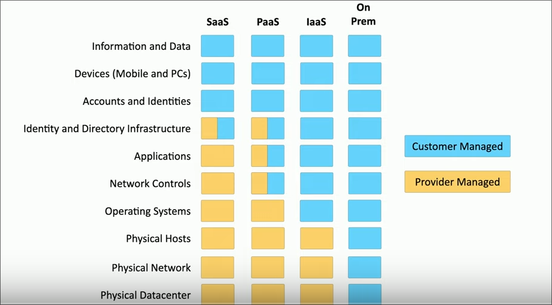
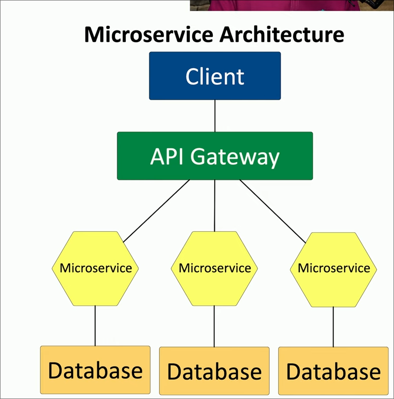
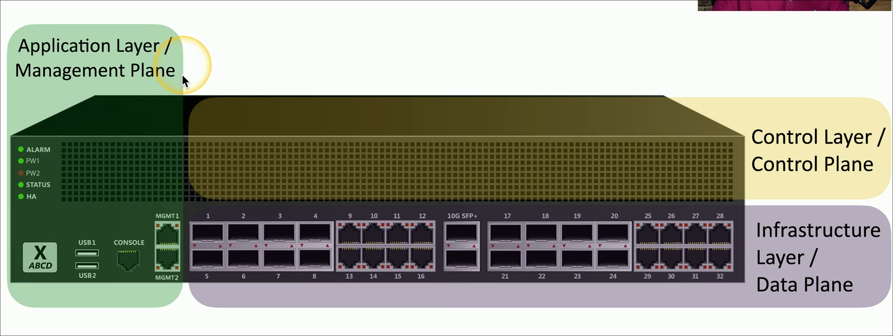
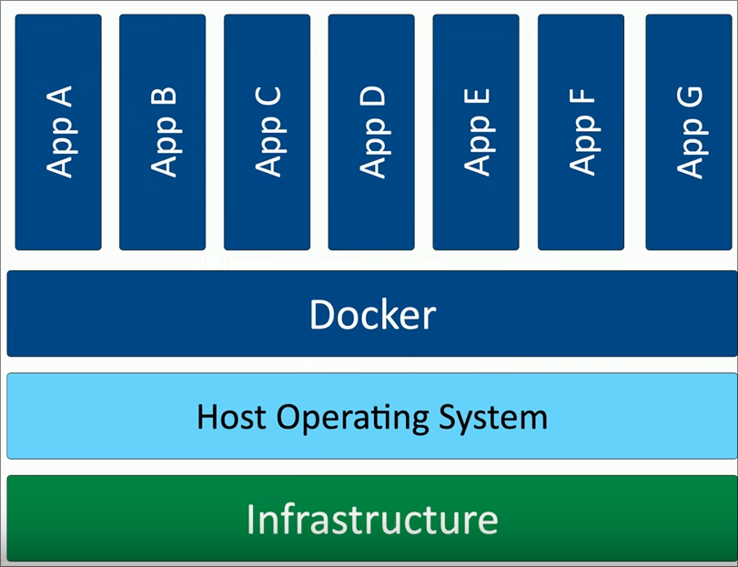
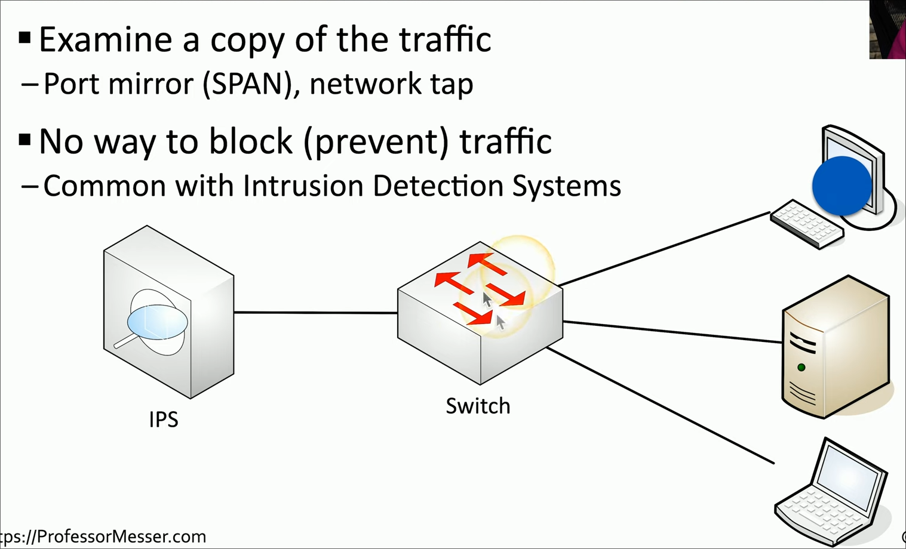
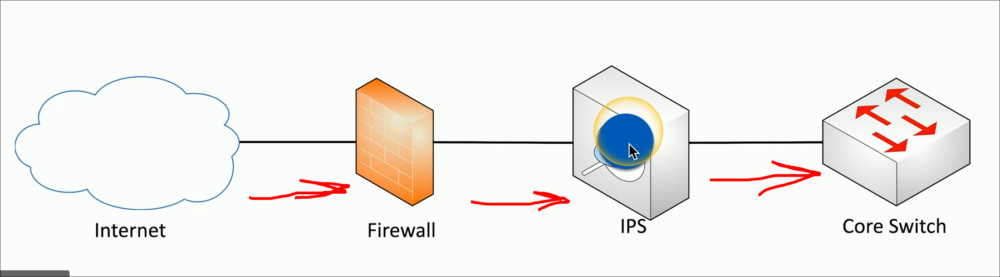
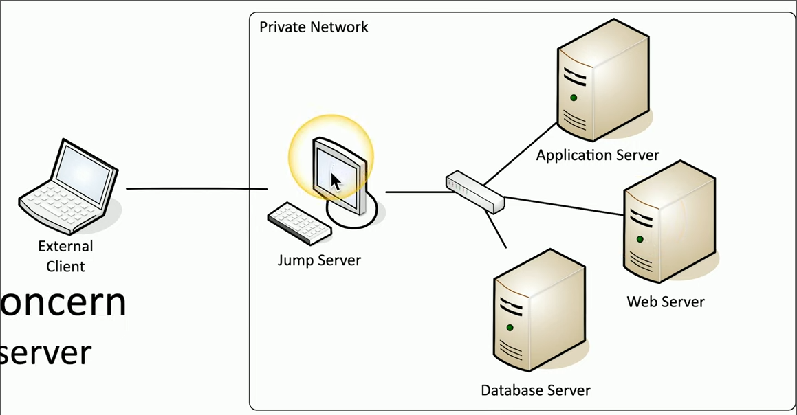
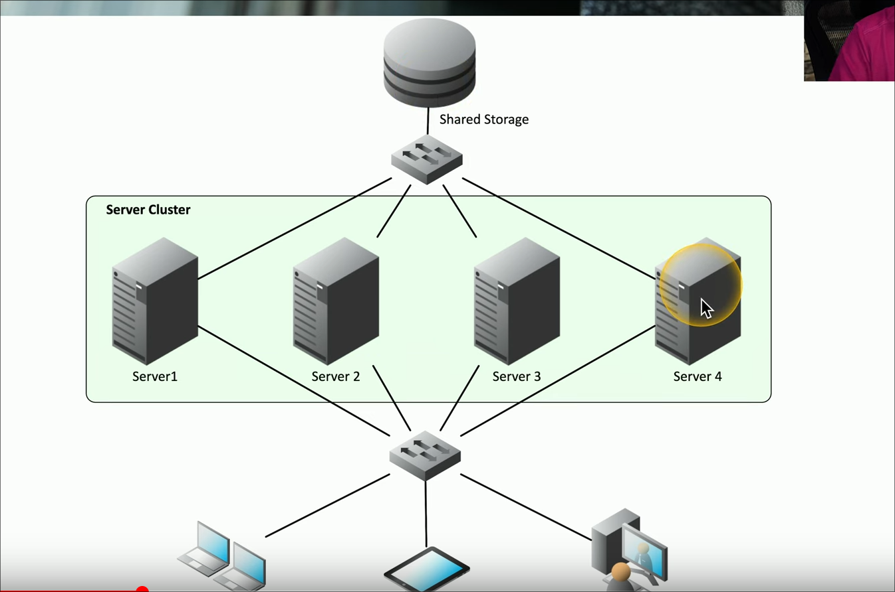

- #Security+
- # Video 3.1.1 Cloud Infrastructure
	- ### Cloud responsibility matrix #card
	  background-color:: yellow
	  card-last-interval:: 11.2
	  card-repeats:: 3
	  card-ease-factor:: 2.8
	  card-next-schedule:: 2025-02-24T16:18:51.375Z
	  card-last-reviewed:: 2025-02-13T12:18:51.375Z
	  card-last-score:: 5
		- shows whos is responsible for security
		- 
	- ### Hybrid consideration #card
	  background-color:: green
	  card-last-interval:: 13.8
	  card-repeats:: 2
	  card-ease-factor:: 2.6
	  card-next-schedule:: 2025-02-22T10:29:38.205Z
	  card-last-reviewed:: 2025-02-08T15:29:38.205Z
	  card-last-score:: 5
		- more than one public or private cloud
	- ### Vendor risk management policy #card
	  background-color:: blue
	  card-last-interval:: 11.2
	  card-repeats:: 3
	  card-ease-factor:: 2.8
	  card-next-schedule:: 2025-02-24T16:20:03.168Z
	  card-last-reviewed:: 2025-02-13T12:20:03.169Z
	  card-last-score:: 5
		- assess the security of your cloud providers
	- ### Infrastructure as code
	  background-color:: pink
		- define servers network and applications as code
		- {:height 179, :width 180}
	- ### FaaS #card
	  background-color:: pink
	  card-last-interval:: 11.2
	  card-repeats:: 3
	  card-ease-factor:: 2.8
	  card-next-schedule:: 2025-02-24T16:19:56.815Z
	  card-last-reviewed:: 2025-02-13T12:19:56.815Z
	  card-last-score:: 5
		- function as a service
		- remove the operating system from the equation
		- applications are separated into individual autonomous functions
	- ### Monolithic applications
	  background-color:: red
		- one big app does everything
	- ### APIs and micro services #card
	  background-color:: pink
	  card-last-interval:: 11.2
	  card-repeats:: 3
	  card-ease-factor:: 2.8
	  card-next-schedule:: 2025-02-24T16:20:07.483Z
	  card-last-reviewed:: 2025-02-13T12:20:07.484Z
	  card-last-score:: 5
		- application programming interfaces
		- is the glue for the microservices
		- more resilient
		- {:height 379, :width 381}
- # Video 3.1.2 Network Infrastructure Concepts
	- ### SDN #card
	  background-color:: red
	  card-last-interval:: 13.8
	  card-repeats:: 2
	  card-ease-factor:: 2.6
	  card-next-schedule:: 2025-02-22T10:29:42.569Z
	  card-last-reviewed:: 2025-02-08T15:29:42.569Z
	  card-last-score:: 5
		- software defined networking
		- network devices have different functional planes like data control and management planes
		- perfect for cloud
		- ### Infastructure Layer / Data Plane #card
		  background-color:: green
		  card-last-interval:: 13.8
		  card-repeats:: 2
		  card-ease-factor:: 2.6
		  card-next-schedule:: 2025-02-22T10:30:04.459Z
		  card-last-reviewed:: 2025-02-08T15:30:04.459Z
		  card-last-score:: 5
			- The data on the lines
			- process the network frames and packets
			- forwarding trunking encryption and NAT
		- ### Control Layer / Control plane #card
		  background-color:: blue
		  card-last-interval:: 11.2
		  card-repeats:: 3
		  card-ease-factor:: 2.8
		  card-next-schedule:: 2025-02-24T16:19:58.604Z
		  card-last-reviewed:: 2025-02-13T12:19:58.604Z
		  card-last-score:: 5
			- telling the data where to go
			- manage the actions of the data plane
			- routing tables sessions tables nat tables
		- ### Application Layer #card
		  background-color:: purple
		  card-last-interval:: 11.2
		  card-repeats:: 3
		  card-ease-factor:: 2.8
		  card-next-schedule:: 2025-02-24T16:20:30.116Z
		  card-last-reviewed:: 2025-02-13T12:20:30.116Z
		  card-last-score:: 5
			- configure and manage the device
			- ssh browser api
		- {:height 151, :width 405}
- # Video 3.1.3 Other Infrastructure Concepts
	- ### Containerization #card
	  background-color:: red
	  card-last-interval:: 11.2
	  card-repeats:: 3
	  card-ease-factor:: 2.8
	  card-next-schedule:: 2025-02-24T16:20:10.826Z
	  card-last-reviewed:: 2025-02-13T12:20:10.826Z
	  card-last-score:: 5
		- containes everything you need to run an applciation
		- code and dependcies
		- everything but the OS
		- {:height 323, :width 292}
	- ### SCADA / ICS #card
	  background-color:: pink
	  card-last-interval:: 11.2
	  card-repeats:: 3
	  card-ease-factor:: 2.8
	  card-next-schedule:: 2025-02-24T16:19:55.445Z
	  card-last-reviewed:: 2025-02-13T12:19:55.445Z
	  card-last-score:: 5
		- Supervisory control and data acquisition system
		- Industrial Control System (ICS)
		- Monitor equipment from central panel
		- Completely segmented from outside
	- ### RTOS Real-Time Operating Systems #card
	  background-color:: green
	  card-last-interval:: 11.2
	  card-repeats:: 3
	  card-ease-factor:: 2.8
	  card-next-schedule:: 2025-02-24T16:18:52.627Z
	  card-last-reviewed:: 2025-02-13T12:18:52.628Z
	  card-last-score:: 5
		- A process takes priority
		- military environments and automobiles need priority
		- need to always be available
	- # Video 3.1.4 Infrastructure Considerations
		- ### MTTR #card
		  background-color:: red
		  card-last-interval:: 13.8
		  card-repeats:: 2
		  card-ease-factor:: 2.6
		  card-next-schedule:: 2025-02-22T10:30:06.621Z
		  card-last-reviewed:: 2025-02-08T15:30:06.621Z
		  card-last-score:: 5
			- Mean Time to Repair
		- ### Risk transference #card
		  background-color:: yellow
		  card-last-interval:: 11.2
		  card-repeats:: 3
		  card-ease-factor:: 2.8
		  card-next-schedule:: 2025-02-24T16:20:02.563Z
		  card-last-reviewed:: 2025-02-13T12:20:02.563Z
		  card-last-score:: 5
			- transfer the risk to a third-part
			- cyber security insurance
	- ---
- # Video 3.2.1 Secure Infrastructures
	- ### Firewalls #card
	  background-color:: red
	  card-last-interval:: 11.2
	  card-repeats:: 3
	  card-ease-factor:: 2.8
	  card-next-schedule:: 2025-02-24T16:18:54.390Z
	  card-last-reviewed:: 2025-02-13T12:18:54.391Z
	  card-last-score:: 5
		- segment the network from outside
		- also can use honeypots jump server sensros and load blancer
	- ### Security-Zone #card
	  background-color:: pink
	  card-last-interval:: 11.2
	  card-repeats:: 3
	  card-ease-factor:: 2.8
	  card-next-schedule:: 2025-02-24T16:19:59.797Z
	  card-last-reviewed:: 2025-02-13T12:19:59.797Z
	  card-last-score:: 5
		- Logically segment a network based on the functions of the devices
		- IOT would be on a seperate vlan
		- Simplifies security
- # Video 3.2.2 Intrusion Prevention
	- ### IPS #card
	  background-color:: red
	  card-last-interval:: 11.2
	  card-repeats:: 3
	  card-ease-factor:: 2.8
	  card-next-schedule:: 2025-02-24T16:19:54.690Z
	  card-last-reviewed:: 2025-02-13T12:19:54.690Z
	  card-last-score:: 5
		- Intrusion prevention system
		- watch the network traffic
	- ### IDS #card
	  background-color:: pink
	  card-last-interval:: 13.8
	  card-repeats:: 2
	  card-ease-factor:: 2.6
	  card-next-schedule:: 2025-02-22T10:29:40.328Z
	  card-last-reviewed:: 2025-02-08T15:29:40.328Z
	  card-last-score:: 5
		- Intrusions detection system
	- ### Fail-open #card
	  background-color:: green
	  card-last-interval:: 11.2
	  card-repeats:: 3
	  card-ease-factor:: 2.8
	  card-next-schedule:: 2025-02-24T16:20:04.430Z
	  card-last-reviewed:: 2025-02-13T12:20:04.430Z
	  card-last-score:: 5
		- when it crashes data will continue to flow without security
	- ### Fail-closed #card
	  background-color:: blue
	  card-last-interval:: 13.8
	  card-repeats:: 2
	  card-ease-factor:: 2.6
	  card-next-schedule:: 2025-02-22T10:30:20.546Z
	  card-last-reviewed:: 2025-02-08T15:30:20.546Z
	  card-last-score:: 5
		- security and network connection will be severed
	- ### Passive monitoring #card
	  background-color:: green
	  card-last-interval:: 11.2
	  card-repeats:: 3
	  card-ease-factor:: 2.8
	  card-next-schedule:: 2025-02-24T16:19:58.039Z
	  card-last-reviewed:: 2025-02-13T12:19:58.039Z
	  card-last-score:: 5
		- copies of data are sent to the IPS kind of a IDS since it cant block traffic real time
		- uses port mirror/ SPAN or network tap
		- {:height 286, :width 398}
	- ### Active Monitoring #card
	  background-color:: blue
	  card-last-interval:: 13.8
	  card-repeats:: 2
	  card-ease-factor:: 2.6
	  card-next-schedule:: 2025-02-22T10:29:21.521Z
	  card-last-reviewed:: 2025-02-08T15:29:21.522Z
	  card-last-score:: 5
		- {:height 141, :width 407}
		-
- # Video 3.2.3 Network Appliances
	- ### Jump Server #card
	  background-color:: yellow
	  card-last-interval:: 11.2
	  card-repeats:: 3
	  card-ease-factor:: 2.8
	  card-next-schedule:: 2025-02-24T16:20:05.963Z
	  card-last-reviewed:: 2025-02-13T12:20:05.963Z
	  card-last-score:: 5
		- A server that is accsessible from outside of the network limited to very few admins
		- hardened
		- 
	- ### Proxy Server #card
	  background-color:: pink
	  card-last-interval:: 11.2
	  card-repeats:: 3
	  card-ease-factor:: 2.8
	  card-next-schedule:: 2025-02-24T16:20:29.485Z
	  card-last-reviewed:: 2025-02-13T12:20:29.486Z
	  card-last-score:: 5
		- sits between the users
		- useful for caching, URL filtering, content scanning
		- NAT is a proxy
		- nginx is a application proxy
	- ### Explicit Proxy #card
	  background-color:: red
	  card-last-interval:: 11.2
	  card-repeats:: 3
	  card-ease-factor:: 2.8
	  card-next-schedule:: 2025-02-24T16:20:01.719Z
	  card-last-reviewed:: 2025-02-13T12:20:01.719Z
	  card-last-score:: 5
		- You have to tell the OS or browser to go through the proxy
	- ### Transparent Proxy #card
	  background-color:: blue
	  card-last-interval:: 11.2
	  card-repeats:: 3
	  card-ease-factor:: 2.8
	  card-next-schedule:: 2025-02-24T16:18:53.545Z
	  card-last-reviewed:: 2025-02-13T12:18:53.546Z
	  card-last-score:: 5
		- invisible to the user
	- ### Forward Proxy #card
	  background-color:: purple
	  card-last-interval:: 11.2
	  card-repeats:: 3
	  card-ease-factor:: 2.8
	  card-next-schedule:: 2025-02-24T16:20:00.423Z
	  card-last-reviewed:: 2025-02-13T12:20:00.424Z
	  card-last-score:: 5
		- an internal proxy
		- managing data exiting a network
	- ### Reverse Proxy #card
	  background-color:: green
	  card-last-interval:: 11.2
	  card-repeats:: 3
	  card-ease-factor:: 2.8
	  card-next-schedule:: 2025-02-24T16:19:56.092Z
	  card-last-reviewed:: 2025-02-13T12:19:56.092Z
	  card-last-score:: 5
		- inbound traffic from the internet to youre network
		- nginx proxy on my network
	- ### Open Proxy #card
	  background-color:: blue
	  card-last-interval:: 11.2
	  card-repeats:: 3
	  card-ease-factor:: 2.8
	  card-next-schedule:: 2025-02-24T16:19:59.212Z
	  card-last-reviewed:: 2025-02-13T12:19:59.212Z
	  card-last-score:: 5
		- third party proxy available to anyone to use
		- third party can see your data and inject data
	- ### Active/active load balencing #card
	  background-color:: green
	  card-last-interval:: 11.2
	  card-repeats:: 3
	  card-ease-factor:: 2.8
	  card-next-schedule:: 2025-02-24T16:20:17.794Z
	  card-last-reviewed:: 2025-02-13T12:20:17.794Z
	  card-last-score:: 5
		- all servers are active and being used by the load balencer
		- tcp offload
		- ssl encryption can be done by load balance
		- can cache
		- QoS prioritization
	- ### Active/passive load balancing #card
	  background-color:: red
	  card-last-interval:: 11.2
	  card-repeats:: 3
	  card-ease-factor:: 2.8
	  card-next-schedule:: 2025-02-24T16:20:06.745Z
	  card-last-reviewed:: 2025-02-13T12:20:06.746Z
	  card-last-score:: 5
		- some servers are being active and others are on standby
	- ### SIEM #card
	  background-color:: purple
	  card-last-interval:: 10.6
	  card-repeats:: 3
	  card-ease-factor:: 2.56
	  card-next-schedule:: 2025-02-24T02:15:25.354Z
	  card-last-reviewed:: 2025-02-13T12:15:25.355Z
	  card-last-score:: 5
		- Security information event manager
		- collects logs from many different sensors on the network
- # Video 3.2.4 Port Security
	- Lock down yo ports
	- ### EAP
	  background-color:: red
		- Extensible Authentication Protocol
		- 802.1x prevent access to the network until the authentication succeeds
	- ### 802.1x
	  background-color:: green
		- NAC or port-based network access control EAP works with 802.1x
		- used with RADIUS LDAP TACACS+ Kerberos etc
- # Video 3.2.5 Firewall Types
	- ### Network Based Firewalls #card
	  background-color:: red
	  card-last-interval:: 11.2
	  card-repeats:: 3
	  card-ease-factor:: 2.8
	  card-next-schedule:: 2025-02-24T16:20:09.983Z
	  card-last-reviewed:: 2025-02-13T12:20:09.984Z
	  card-last-score:: 5
		- OSI layer 4 or newer ones can do 7
		- VPN
		- Can act as Layer 3
		- NAT
	- ### UTM #card
	  background-color:: blue
	  card-last-interval:: 13.8
	  card-repeats:: 2
	  card-ease-factor:: 2.6
	  card-next-schedule:: 2025-02-22T10:29:26.979Z
	  card-last-reviewed:: 2025-02-08T15:29:26.979Z
	  card-last-score:: 5
		- Unified Threat Management Device
		- Web Security gateway
		- URL Filtering/content inspection
		- block malware
		- filter spam
		- CSU/DSU
		- Rout and switching
		- Firewall
		- IPS/IDS
		- VPN
		- Layer 4 lower performance
	- ### NGFW #card
	  background-color:: green
	  card-last-interval:: 11.2
	  card-repeats:: 3
	  card-ease-factor:: 2.8
	  card-next-schedule:: 2025-02-24T16:19:50.205Z
	  card-last-reviewed:: 2025-02-13T12:19:50.206Z
	  card-last-score:: 5
		- Next Gen firewall
		- OSI 7
		- look at all data on network get all the details
		- can read twitter but not post
		- doesn't look just at the port but the actual application
		- opnsense + zenarmor
	- ### WAF
	  background-color:: pink
		- web application firewall
		- works with http/https
		- allow and deny based on expected input
		- can see sql injection
- # Video 3.2.6 Secure Communication                                                                                                                                                                                                                                                                                                                                                                                                                                                                                                                                                                                                                                                                                                                                                                                                                                                                                                                                                                                                                                                                                                                                                                                                                                                                                                                                                                                                                                                                                                                                                                                                                                                                                                                                                                                                                                                                                                                                                                                                                                                                                                                                                                                                                                                                                                                                                                                                                                                                                                                                                                                                                                                                                                                                                                                                                                                                                                                                                                                                                                                                                                                                                                                                                                                                                                                                                                                                                                                                                                                                                                                                                                                                                                                                                                                                                                                                                                                                                                                                                                                                                                                                                                                                                                                                                                                                                                                                                                                                                                                                                                                                                                                                                                                                                                                                                                                                                                                                                                                                                                                                                                                                                                                                                                                                                                                                                                                                                                                                                                                                                                                                                                                                                                                                                                                                                                                                                                                                                                                                                                                                                                                                                                                                                                                                                                                                                                                                                                                                                                                                                                                                                                                                                                                                                                                                                                                                                                                                                                                                                                                                                                                                                                                                                                                                                                                                                                                                                                                                                                                                                                                                                                                                                                                                                                                                                                                                                                                                                                                                                                                                                                                                                                                                                                                                                                                                                                                                                                                                                                                                                                                                                                                                                                                                                                                                                                                                                                                                                                                                                                                                                                                                                                                                                                                                                                                                                                                                                                                                                                                                                                                                                                                                                                                                                                                                                                                                                                                                                                                                                                                                                                                                                                                                                                                                                                                                                                                                                                                                                                                                                                                                                                                                                                                                                                                                                                                                                                                                                                                                                                                                                                                                                                                                                                                                                                                                                                                                                                                                                                                                                                                                                                                                                                                                                                                                                                                                                                                                                                                                                                                                                                                                                                                                                                                                                                                                                                                                                                                                                                                                                                                                                                                                                                                                                                                                                                                                                                                                                                                                                                                                                                                                                                                                                                                                                                                                                                                                                                                                                                                                                                                                                                                                                                                                                                                                                                                                                                                                                                                                                                                                                                                                                                                                                                                                                                                                                                                                                                                                                                                                                                                                                                                                                                                                                                                                                                                                                                                                                                                                                                                                                                                                                                                                                                                                                                                                                                                                                                                                                                                                                                                                                                                                                                                                                                                                                                                                                                                                                                                                                                                                                                                                                                                                                                                                                                                                                                                                                                                                                                                                                                                                                                                                                                                                                                                                                                                                                                                                                                                                                                                                                                                                                                                                                                                                                                                                                                                                                                                                                                                                                                                                                                                                                                                                                                                                                                                                                                                                                                                                                                                                                                                                                                                                                                                                                                                                                                                                                                                                                                                                                                                                                                                                                                                                                                                                                                                                                                                                                                                                                                                                                                                                                                                                                                                                                                                                                                                                                                                                                                                                                                                                                                                                                                                                                                                                                                                                                                                                                                                                                                                                                                                                                                                                                                                                                                                                                                                                                                                                                                                                                                                                                                                                                                                                                                                                                                                                                                                                                                                                                                                                                                                                                                                                                                                                                                                                                                                                                                                                                                                                                                                                                                                                                                                                                                                                                                                                                                                                                                                                                                                                                                                                                                                                                                                                                                                                                                                                                                                                                                                                                                                                                                                                                                                                                                                                                                                                                                                                                                                                                                                                                                                                                                                                                                                                                                                                                                                                                                                                                                                                                                                                                                                                                                                                                                                                                                                                                          
  
  ---
- # Video 3.3.1 Data Types and Classifications
	- ### Regulated Data #card
	  background-color:: yellow
	  card-last-interval:: 11.2
	  card-repeats:: 3
	  card-ease-factor:: 2.8
	  card-next-schedule:: 2025-02-24T16:19:57.407Z
	  card-last-reviewed:: 2025-02-13T12:19:57.408Z
	  card-last-score:: 5
		- managed by third party
		- credit card stuff
		- trade secrets for organization
		- intellectual data such as trademarks and patents
	- ### Legal information #card
	  background-color:: red
	  card-last-interval:: 13.8
	  card-repeats:: 2
	  card-ease-factor:: 2.6
	  card-next-schedule:: 2025-02-22T10:30:16.997Z
	  card-last-reviewed:: 2025-02-08T15:30:16.998Z
	  card-last-score:: 5
		- court records documents attory information is public
		- but PII is secret
	- ### PHI #card
	  background-color:: green
	  card-last-interval:: 13.8
	  card-repeats:: 2
	  card-ease-factor:: 2.6
	  card-next-schedule:: 2025-02-22T10:29:32.718Z
	  card-last-reviewed:: 2025-02-08T15:29:32.718Z
	  card-last-score:: 5
		- protected health information
		- health status health care records
- # Video 3.3.2 States of Data
	- ### GDPR #card
	  background-color:: yellow
	  card-last-interval:: 10.6
	  card-repeats:: 3
	  card-ease-factor:: 2.56
	  card-next-schedule:: 2025-02-24T02:15:31.307Z
	  card-last-reviewed:: 2025-02-13T12:15:31.309Z
	  card-last-score:: 5
		- General Data Protection Regulation
		- European data laws any data collected from Europeans must be held in the EU
	- ### Data Sovereignty #card
	  background-color:: green
	  card-last-interval:: 11.2
	  card-repeats:: 3
	  card-ease-factor:: 2.8
	  card-next-schedule:: 2025-02-24T16:19:53.998Z
	  card-last-reviewed:: 2025-02-13T12:19:53.998Z
	  card-last-score:: 5
		- data that resides in a country has to follow its regulations
- # Video 3.3.3 Protecting Data
	- ### network location  mobile #card
	  background-color:: red
	  card-last-interval:: 13.8
	  card-repeats:: 2
	  card-ease-factor:: 2.6
	  card-next-schedule:: 2025-02-22T10:30:10.791Z
	  card-last-reviewed:: 2025-02-08T15:30:10.792Z
	  card-last-score:: 5
		- identify based on ip subnet
		- GPS
		- 802.11
		- Ip addresses, not accurate
	- ### Geo Fencing
	  background-color:: yellow
		- locking data based on where the user is
		- if a dude is in the building he can access the data if hes at home he cant
- ---
- # Video 3.4.1 Resiliency
	- ### HA #card
	  background-color:: red
	  card-last-interval:: 11.2
	  card-repeats:: 3
	  card-ease-factor:: 2.8
	  card-next-schedule:: 2025-02-24T16:20:03.812Z
	  card-last-reviewed:: 2025-02-13T12:20:03.812Z
	  card-last-score:: 5
		- High Availability
		- system running in parallel for if the main one fails
		- $$$
	- ### Server Clustering #card
	  background-color:: pink
	  card-last-interval:: 11.2
	  card-repeats:: 3
	  card-ease-factor:: 2.8
	  card-next-schedule:: 2025-02-24T16:20:08.503Z
	  card-last-reviewed:: 2025-02-13T12:20:08.505Z
	  card-last-score:: 5
		- combine two or more servers
		- scalable
		- usually within the OS
		- {:height 239, :width 323}
	- ### Site resiliency #card
	  background-color:: blue
	  card-last-interval:: 13.8
	  card-repeats:: 2
	  card-ease-factor:: 2.6
	  card-next-schedule:: 2025-02-22T10:29:29.086Z
	  card-last-reviewed:: 2025-02-08T15:29:29.086Z
	  card-last-score:: 5
		- where a whole network is off site when the main one fails
	- ### Hot site #card
	  background-color:: green
	  card-last-interval:: 11.2
	  card-repeats:: 3
	  card-ease-factor:: 2.8
	  card-next-schedule:: 2025-02-24T16:20:28.688Z
	  card-last-reviewed:: 2025-02-13T12:20:28.688Z
	  card-last-score:: 5
		- a data center where are the data is duplicated
	- ### Cold Site #card
	  background-color:: blue
	  card-last-interval:: 11.2
	  card-repeats:: 3
	  card-ease-factor:: 2.8
	  card-next-schedule:: 2025-02-24T16:20:05.130Z
	  card-last-reviewed:: 2025-02-13T12:20:05.130Z
	  card-last-score:: 5
		- Empty Building
		- bring all data and equipment and people to run the site
	- ### Warm Site #card
	  background-color:: purple
	  card-last-interval:: 13.8
	  card-repeats:: 2
	  card-ease-factor:: 2.6
	  card-next-schedule:: 2025-02-22T10:29:35.063Z
	  card-last-reviewed:: 2025-02-08T15:29:35.063Z
	  card-last-score:: 5
		- some equipment is on site
	- ### Geographic dispersion #card
	  background-color:: red
	  card-last-interval:: 11.2
	  card-repeats:: 3
	  card-ease-factor:: 2.8
	  card-next-schedule:: 2025-02-24T16:20:30.670Z
	  card-last-reviewed:: 2025-02-13T12:20:30.670Z
	  card-last-score:: 5
		- these sites should be physically different than the organizations primary location
	- ### Platform Diversity #card
	  background-color:: pink
	  card-last-interval:: 11.2
	  card-repeats:: 3
	  card-ease-factor:: 2.8
	  card-next-schedule:: 2025-02-24T16:20:00.957Z
	  card-last-reviewed:: 2025-02-13T12:20:00.957Z
	  card-last-score:: 5
		- keep systems diverse in case one OS has a vulnerability
	- ### COOP #card
	  background-color:: blue
	  card-last-interval:: 11.2
	  card-repeats:: 3
	  card-ease-factor:: 2.8
	  card-next-schedule:: 2025-02-24T16:18:59.211Z
	  card-last-reviewed:: 2025-02-13T12:18:59.211Z
	  card-last-score:: 5
		- Continuity of operation planning
		- in case tech fails how do  we do things manually or differently
- # Video 3.4.2 Capacity Planning
	- Try to predict supply and demand
- # Video 3.4.3 Recovery Testing
	- Fake a scenerio
	- follow procedures and recover
	- revise and improve
- ### Tabletop exercise #card
  background-color:: yellow
  card-last-interval:: 13.8
  card-repeats:: 2
  card-ease-factor:: 2.6
  card-next-schedule:: 2025-02-22T10:30:18.561Z
  card-last-reviewed:: 2025-02-08T15:30:18.562Z
  card-last-score:: 5
	- Virtually testing a recovery system
- # Video 3.4.4 Backups
- # Video 3.4.5 Power Resiliency