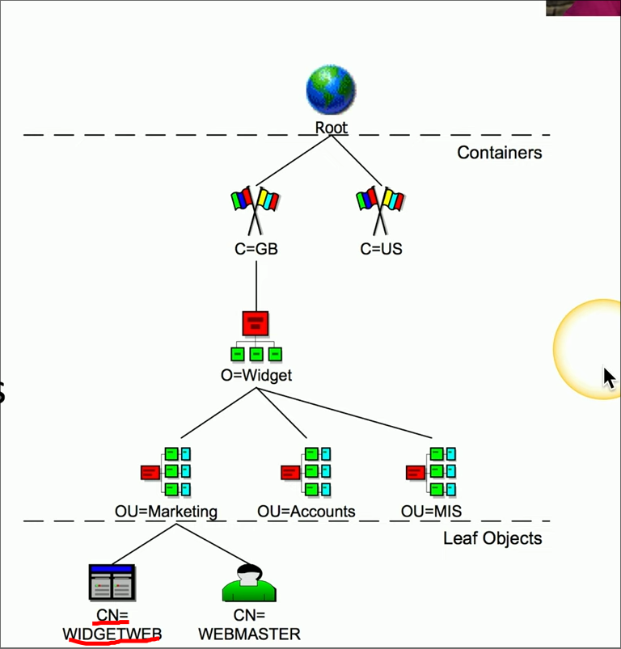
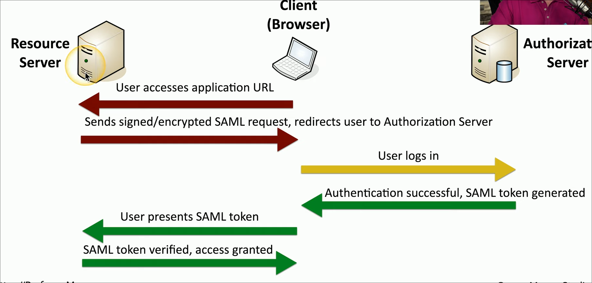

# Video 4.1.1 Secure Baselines
	- Security Baselines are often created by the system manufacturer
- # Video 4.1.2 Hardening Targets
	-
- # Video 4.1.3 Securing Wireless and Mobile
	- ### Site Servays #card
	  background-color:: yellow
	  card-last-interval:: 4.14
	  card-repeats:: 2
	  card-ease-factor:: 2.7
	  card-next-schedule:: 2025-02-12T18:41:55.622Z
	  card-last-reviewed:: 2025-02-08T15:41:55.622Z
	  card-last-score:: 5
		- determine the wireless landscape
		- identify the existing APs
		- heat map
	- ### Wireless survey tools #card
	  background-color:: red
	  card-last-interval:: 104.13
	  card-repeats:: 2
	  card-ease-factor:: 2.6
	  card-next-schedule:: 2025-05-23T18:41:27.660Z
	  card-last-reviewed:: 2025-02-08T15:41:27.661Z
	  card-last-score:: 5
		- show details of the exisitng wireless network
		- you may be able to see interference or problem areas using this
	- ### MDM #card
	  background-color:: green
	  card-last-interval:: 104.13
	  card-repeats:: 2
	  card-ease-factor:: 2.6
	  card-next-schedule:: 2025-05-23T18:41:21.140Z
	  card-last-reviewed:: 2025-02-08T15:41:21.141Z
	  card-last-score:: 5
		- mobile device manager
		- can administer mobile devices, check security polices and apps
	- ### BYOD #card
	  background-color:: blue
	  card-last-interval:: 104.13
	  card-repeats:: 2
	  card-ease-factor:: 2.6
	  card-next-schedule:: 2025-05-23T18:41:26.683Z
	  card-last-reviewed:: 2025-02-08T15:41:26.684Z
	  card-last-score:: 5
		- bring your own device
		- have to meet companies requirements
	- ### COPE #card
	  background-color:: purple
	  card-last-interval:: 104.13
	  card-repeats:: 2
	  card-ease-factor:: 2.6
	  card-next-schedule:: 2025-05-23T18:41:29.425Z
	  card-last-reviewed:: 2025-02-08T15:41:29.426Z
	  card-last-score:: 5
		- corporate owned personally enabled
		- company buys the device for users
	- ### CYOD #card
	  background-color:: red
	  card-last-interval:: 104.13
	  card-repeats:: 2
	  card-ease-factor:: 2.6
	  card-next-schedule:: 2025-05-23T18:41:17.647Z
	  card-last-reviewed:: 2025-02-08T15:41:17.648Z
	  card-last-score:: 5
		- Choose your own device
	- ### PAN #card
	  background-color:: blue
	  card-last-interval:: 4.14
	  card-repeats:: 2
	  card-ease-factor:: 2.46
	  card-next-schedule:: 2025-02-12T18:41:37.229Z
	  card-last-reviewed:: 2025-02-08T15:41:37.230Z
	  card-last-score:: 5
		- personal area network
		- Bluetooth is a PAN
	-
- # Video 4.1.4 Wireless Security Settings
	- ### MIC #card
	  background-color:: yellow
	  card-last-interval:: -1
	  card-repeats:: 1
	  card-ease-factor:: 2.6
	  card-next-schedule:: 2025-02-09T15:00:00.000Z
	  card-last-reviewed:: 2025-02-08T15:41:54.019Z
	  card-last-score:: 1
		- message integrity check
		- checks the integrity of wireless data
	- ### WPA2 #card
	  background-color:: blue
	  card-last-interval:: 4.14
	  card-repeats:: 2
	  card-ease-factor:: 2.7
	  card-next-schedule:: 2025-02-12T18:41:57.102Z
	  card-last-reviewed:: 2025-02-08T15:41:57.102Z
	  card-last-score:: 5
		- a wireless security standard
		- security flaw
		- attackers can capture the hash and brute force it offline PSK
	- ### PSK #card
	  background-color:: green
	  card-last-interval:: 4.14
	  card-repeats:: 2
	  card-ease-factor:: 2.7
	  card-next-schedule:: 2025-02-12T18:41:48.635Z
	  card-last-reviewed:: 2025-02-08T15:41:48.636Z
	  card-last-score:: 5
		- Pre shared key
	- ### WPA3 #card
	  background-color:: pink
	  card-last-interval:: 4.14
	  card-repeats:: 2
	  card-ease-factor:: 2.7
	  card-next-schedule:: 2025-02-12T18:41:46.238Z
	  card-last-reviewed:: 2025-02-08T15:41:46.239Z
	  card-last-score:: 5
		- fixed the shared hash issue
		- uses the GCMP block cipher mode
		- creates a shared session key without sharing it across the network
	- ### GCMP #card
	  background-color:: red
	  card-last-interval:: 104.13
	  card-repeats:: 2
	  card-ease-factor:: 2.6
	  card-next-schedule:: 2025-05-23T18:41:25.222Z
	  card-last-reviewed:: 2025-02-08T15:41:25.222Z
	  card-last-score:: 5
		- Galois/Counter mode protocol
		- stronger encryption that wpa3
		- AES and a MIC built in
	- ### SAE #card
	  background-color:: yellow
	  card-last-interval:: 104.13
	  card-repeats:: 2
	  card-ease-factor:: 2.6
	  card-next-schedule:: 2025-05-23T18:41:23.028Z
	  card-last-reviewed:: 2025-02-08T15:41:23.029Z
	  card-last-score:: 5
		- Simultaneous authentication of equals
		- Diffie-hellman key exchanged with a beautification comonent
		- dif encryption for user but useing the same password
		- you cant see other peoples traffic
	- ### RADIUS #card
	  background-color:: pink
	  card-last-interval:: 4.14
	  card-repeats:: 2
	  card-ease-factor:: 2.7
	  card-next-schedule:: 2025-02-12T18:41:58.101Z
	  card-last-reviewed:: 2025-02-08T15:41:58.102Z
	  card-last-score:: 5
		- remote authentication dial in user service
- # Video 4.1.5 Application Security
	- ### Input validation #card
	  background-color:: blue
	  card-last-interval:: 4.14
	  card-repeats:: 2
	  card-ease-factor:: 2.7
	  card-next-schedule:: 2025-02-12T18:42:03.365Z
	  card-last-reviewed:: 2025-02-08T15:42:03.365Z
	  card-last-score:: 5
		- a certain number of charterers expected
	- ### Secure cookies #card
	  background-color:: purple
	  card-last-interval:: 4.14
	  card-repeats:: 2
	  card-ease-factor:: 2.7
	  card-next-schedule:: 2025-02-12T18:42:05.619Z
	  card-last-reviewed:: 2025-02-08T15:42:05.620Z
	  card-last-score:: 5
		- a type of cookies that requires https
	- ### SAST #card
	  background-color:: red
	  card-last-interval:: 4.14
	  card-repeats:: 2
	  card-ease-factor:: 2.7
	  card-next-schedule:: 2025-02-12T18:42:07.658Z
	  card-last-reviewed:: 2025-02-08T15:42:07.659Z
	  card-last-score:: 5
		- Static code anaylsis
		- software that will look through the source code
		- see buffer overflows
		- not perfect
	- ### Code signing #card
	  background-color:: red
	  card-last-interval:: 4.14
	  card-repeats:: 2
	  card-ease-factor:: 2.7
	  card-next-schedule:: 2025-02-12T18:42:10.145Z
	  card-last-reviewed:: 2025-02-08T15:42:10.146Z
	  card-last-score:: 5
		- A way to check if code was unmodified
		- trusted
	- ### Sandboxing #card
	  background-color:: green
	  card-last-interval:: 4.14
	  card-repeats:: 2
	  card-ease-factor:: 2.7
	  card-next-schedule:: 2025-02-12T18:42:08.906Z
	  card-last-reviewed:: 2025-02-08T15:42:08.907Z
	  card-last-score:: 5
		- a area where an application can be tested in a virtual environment
- # Video 4.2.1 Asset Management
	- ### Central asset tracking system #card
	  background-color:: yellow
	  card-last-interval:: 4.14
	  card-repeats:: 2
	  card-ease-factor:: 2.7
	  card-next-schedule:: 2025-02-12T18:45:23.176Z
	  card-last-reviewed:: 2025-02-08T15:45:23.177Z
	  card-last-score:: 5
		- central location to track all company assets
- # Video 4.3.1 Vulnerability Scanning
	- ### port scan #card
	  background-color:: red
	  card-last-interval:: 4.14
	  card-repeats:: 2
	  card-ease-factor:: 2.7
	  card-next-schedule:: 2025-02-12T18:45:20.388Z
	  card-last-reviewed:: 2025-02-08T15:45:20.389Z
	  card-last-score:: 5
		- shows open ports on a network
		- test from the outside
		- but sould also check inside for inside attacky
	- ### Dynamic analysis/fuzzing #card
	  background-color:: green
	  card-last-interval:: 4.14
	  card-repeats:: 2
	  card-ease-factor:: 2.7
	  card-next-schedule:: 2025-02-12T18:45:33.032Z
	  card-last-reviewed:: 2025-02-08T15:45:33.033Z
	  card-last-score:: 5
		- send random code to running app
		- look for unexpected return
	- ### Package monitoring #card
	  background-color:: purple
	  card-last-interval:: 4.14
	  card-repeats:: 2
	  card-ease-factor:: 2.7
	  card-next-schedule:: 2025-02-12T18:45:28.901Z
	  card-last-reviewed:: 2025-02-08T15:45:28.901Z
	  card-last-score:: 5
		- make surethe package is legit
		- run it in a lab environment
- # Video 4.3.2 Threat Intelligence
	- ### OSINT #card
	  background-color:: pink
	  card-last-interval:: 4.14
	  card-repeats:: 2
	  card-ease-factor:: 2.7
	  card-next-schedule:: 2025-02-12T18:45:30.442Z
	  card-last-reviewed:: 2025-02-08T15:45:30.443Z
	  card-last-score:: 5
		- Open source intelligence
		- publicly available information
	- ### CTA #card
	  background-color:: blue
	  card-last-interval:: -1
	  card-repeats:: 1
	  card-ease-factor:: 2.6
	  card-next-schedule:: 2025-02-09T15:00:00.000Z
	  card-last-reviewed:: 2025-02-08T15:45:25.996Z
	  card-last-score:: 1
		- Cyber threat anylsis
		- DB for sharing threat scores with eachother
		-
- # Video 4.3.3 Penetration Testing
	- ### Rules of engagement #card
	  background-color:: red
	  card-last-interval:: 4.14
	  card-repeats:: 2
	  card-ease-factor:: 2.7
	  card-next-schedule:: 2025-02-12T18:45:35.269Z
	  card-last-reviewed:: 2025-02-08T15:45:35.269Z
	  card-last-score:: 5
		- rules for everyone so they know the scope and reason for the pen test
		- when
		- what internal/external
		- what devices
- # Video 4.3.4 Analyzing Vulnerabilities
	- ### False Positive #card
	  background-color:: green
	  card-last-interval:: 4.14
	  card-repeats:: 2
	  card-ease-factor:: 2.7
	  card-next-schedule:: 2025-02-12T18:45:22.219Z
	  card-last-reviewed:: 2025-02-08T15:45:22.219Z
	  card-last-score:: 5
		- false information on vulnerability being marked
	- ### False negative #card
	  background-color:: red
	  card-last-interval:: 4.14
	  card-repeats:: 2
	  card-ease-factor:: 2.7
	  card-next-schedule:: 2025-02-12T18:45:27.722Z
	  card-last-reviewed:: 2025-02-08T15:45:27.722Z
	  card-last-score:: 5
		- vulnerability that is actual existent is marked as not
	- ### CVSS #card
	  background-color:: blue
	  card-last-interval:: 4.14
	  card-repeats:: 2
	  card-ease-factor:: 2.7
	  card-next-schedule:: 2025-02-12T18:45:21.451Z
	  card-last-reviewed:: 2025-02-08T15:45:21.452Z
	  card-last-score:: 5
		- Common venerability scoring system
		- scores vulnerabilities based on severity
	- ### Vulnerability scanner #card
	  background-color:: pink
	  card-last-interval:: 13.8
	  card-repeats:: 1
	  card-ease-factor:: 2.6
	  card-next-schedule:: 2025-02-22T10:13:36.101Z
	  card-last-reviewed:: 2025-02-08T15:13:36.102Z
	  card-last-score:: 5
		- can scan apps web apps and others
		- firewalls switches
		- can tell you what you can do to fix somtimes
	- ### Exposure Factor #card
	  background-color:: green
	  card-last-interval:: 13.8
	  card-repeats:: 1
	  card-ease-factor:: 2.6
	  card-next-schedule:: 2025-02-22T10:21:14.576Z
	  card-last-reviewed:: 2025-02-08T15:21:14.576Z
	  card-last-score:: 5
		- the percetage that the vulnerbility could fail the service
		- a DDoS could limit the service to 50%
		  a buffer overflow could crash the app and take it down 100%
	- ### Environment variables
	  background-color:: blue
		- how important is the device to the network
		- how many users rely on it is it part of the main network?
	- ### Risk tolerance
	  background-color:: purple
		- Low tolerence means it needs to be patched
		- high tolerance means meh we can patch other stuff
- # Video 4.3.5 Vulnerability Remediation
	- ### Insurance #card
	  background-color:: green
	  card-last-interval:: 13.8
	  card-repeats:: 1
	  card-ease-factor:: 2.6
	  card-next-schedule:: 2025-02-22T10:25:45.862Z
	  card-last-reviewed:: 2025-02-08T15:25:45.863Z
	  card-last-score:: 5
		- offload risk to others
	- ### Ways you can segment a network #card
	  background-color:: blue
	  card-last-interval:: 13.8
	  card-repeats:: 1
	  card-ease-factor:: 2.6
	  card-next-schedule:: 2025-02-22T10:15:52.075Z
	  card-last-reviewed:: 2025-02-08T15:15:52.075Z
	  card-last-score:: 5
		- physical
		- logical w/ vlans
		- firewalls
	- ### compensating controles #card
	  background-color:: purple
	  card-last-interval:: 13.8
	  card-repeats:: 1
	  card-ease-factor:: 2.6
	  card-next-schedule:: 2025-02-22T10:13:14.453Z
	  card-last-reviewed:: 2025-02-08T15:13:14.454Z
	  card-last-score:: 5
		- when you cant deploy a patch
		- no internal firewalls
		- you can disable the service or limit external use, or modify the security controls and software firewalls to  block a port that the service uses
	- ### Exception or exemption #card
	  background-color:: red
	  card-last-interval:: 13.8
	  card-repeats:: 1
	  card-ease-factor:: 2.6
	  card-next-schedule:: 2025-02-22T10:20:33.905Z
	  card-last-reviewed:: 2025-02-08T15:20:33.906Z
	  card-last-score:: 5
		- when a service can not be patched
		- you want to provide the service but also want to protect the data and systems
		- this will be determined by the severity of the exploit and how it can be exploited
			- for example a user may need to be local to exploit the service
	- ### Validation of remediation #card
	  background-color:: yellow
	  card-last-interval:: 13.8
	  card-repeats:: 1
	  card-ease-factor:: 2.6
	  card-next-schedule:: 2025-02-22T10:20:27.475Z
	  card-last-reviewed:: 2025-02-08T15:20:27.476Z
	  card-last-score:: 5
		- make sure the patch did what it was supposed to do
		- preform a scan of the app to see the change
		- audits can be preformed to check that the patch actauly happened
- # Video 4.4.1 Security Monitoring
-
- # Video 4.4.2 Security Tools
	- ### SCAP #card
	  background-color:: yellow
	  card-last-interval:: -1
	  card-repeats:: 1
	  card-ease-factor:: 2.5
	  card-next-schedule:: 2025-02-09T15:00:00.000Z
	  card-last-reviewed:: 2025-02-08T15:28:45.677Z
	  card-last-score:: 1
		- Security Content Automation protocol
		- managed by the NIST
		- Firewalls IPS, vulnerability scanners etc
	- ### NIST #card
	  background-color:: red
	  card-last-interval:: 13.8
	  card-repeats:: 1
	  card-ease-factor:: 2.6
	  card-next-schedule:: 2025-02-22T10:18:46.604Z
	  card-last-reviewed:: 2025-02-08T15:18:46.604Z
	  card-last-score:: 5
		- National institute of Standards and Technology
	- ### Agent / agentless #card
	  background-color:: green
	  card-last-interval:: 13.8
	  card-repeats:: 1
	  card-ease-factor:: 2.6
	  card-next-schedule:: 2025-02-22T02:13:26.227Z
	  card-last-reviewed:: 2025-02-08T07:13:26.227Z
	  card-last-score:: 5
		- Scans stuff automatically pre installed app on the system
		- an agentless is a app that is temperarily installed during a certian process not on the machien the whoel time
	- ### DLP #card
	  background-color:: blue
	  card-last-interval:: 13.8
	  card-repeats:: 1
	  card-ease-factor:: 2.6
	  card-next-schedule:: 2025-02-22T10:25:51.451Z
	  card-last-reviewed:: 2025-02-08T15:25:51.452Z
	  card-last-score:: 5
		- Data loss prevention
		- make sure data like socials credits and what not are not leaking
		- use multiple enpoints and collaborative tools to monitor the data leaving
		- Data in memory would use a endpoint DLP
	- ### SNMP #card
	  background-color:: purple
	  card-last-interval:: -1
	  card-repeats:: 1
	  card-ease-factor:: 2.5
	  card-next-schedule:: 2025-02-09T15:00:00.000Z
	  card-last-reviewed:: 2025-02-08T15:46:05.218Z
	  card-last-score:: 1
		- Simple network managment protocol
	- ### MIB #card
	  background-color:: yellow
	  card-last-interval:: 13.8
	  card-repeats:: 1
	  card-ease-factor:: 2.6
	  card-next-schedule:: 2025-02-22T10:25:55.214Z
	  card-last-reviewed:: 2025-02-08T15:25:55.214Z
	  card-last-score:: 5
		- Managment information base
	- ### OIDs #card
	  background-color:: pink
	  card-last-interval:: 13.8
	  card-repeats:: 1
	  card-ease-factor:: 2.6
	  card-next-schedule:: 2025-02-22T10:18:03.033Z
	  card-last-reviewed:: 2025-02-08T15:18:03.033Z
	  card-last-score:: 5
		- Object identifiers
	- ### SNMP traps #card
	  background-color:: purple
	  card-last-interval:: 13.8
	  card-repeats:: 1
	  card-ease-factor:: 2.6
	  card-next-schedule:: 2025-02-22T10:20:22.447Z
	  card-last-reviewed:: 2025-02-08T15:20:22.447Z
	  card-last-score:: 5
		- SNMP data transfer requires a poll request
		- you can root out fake devices by sending i regular poll requests
		- communicates over 162/udp
		- if the CRC error increases by 5 send a trap
	- ### NetFlow #card
	  background-color:: red
	  card-last-interval:: 13.8
	  card-repeats:: 1
	  card-ease-factor:: 2.6
	  card-next-schedule:: 2025-02-22T10:24:27.513Z
	  card-last-reviewed:: 2025-02-08T15:24:27.513Z
	  card-last-score:: 5
		- A standard for monitoring data on a network
		- ususaly included in hardware like switches or routers
		- Some agents have comparability with it as well
		- {:height 304, :width 541}
- # Video 4.5.1 Firewalls
	- ### Microsoft RDP #card
	  background-color:: green
	  card-last-interval:: 13.8
	  card-repeats:: 1
	  card-ease-factor:: 2.6
	  card-next-schedule:: 2025-02-22T10:26:03.641Z
	  card-last-reviewed:: 2025-02-08T15:26:03.642Z
	  card-last-score:: 5
		- port 3389
	- ### NTP #card
	  background-color:: blue
	  card-last-interval:: 13.8
	  card-repeats:: 1
	  card-ease-factor:: 2.6
	  card-next-schedule:: 2025-02-22T10:18:17.242Z
	  card-last-reviewed:: 2025-02-08T15:18:17.242Z
	  card-last-score:: 5
		- Network Time Protocol
		- port 123
	- ### Web server Firewall Rules #card
	  background-color:: purple
	  card-last-interval:: 13.8
	  card-repeats:: 1
	  card-ease-factor:: 2.6
	  card-next-schedule:: 2025-02-22T10:21:41.074Z
	  card-last-reviewed:: 2025-02-08T15:21:41.075Z
	  card-last-score:: 5
		- rule number
		- remote ip
		- remote port
		- local port
		- protocol
		- action- allow/deny
	- ### Screened sub-net #card
	  background-color:: red
	  card-last-interval:: 13.8
	  card-repeats:: 1
	  card-ease-factor:: 2.6
	  card-next-schedule:: 2025-02-22T10:28:24.532Z
	  card-last-reviewed:: 2025-02-08T15:28:24.532Z
	  card-last-score:: 5
		- an aditional layer of security between you and the internet
		-
	-
- # Video 4.5.2 Web Filtering
	- ### Content Filter #card
	  background-color:: yellow
	  card-last-interval:: 13.8
	  card-repeats:: 1
	  card-ease-factor:: 2.6
	  card-next-schedule:: 2025-02-22T10:25:43.926Z
	  card-last-reviewed:: 2025-02-08T15:25:43.927Z
	  card-last-score:: 5
		- URL Filter
		- proxy or agents
		- controller what data is going in and out
		- block urls for sensitive information and malware
		- reputation
			- based on the risk of the site, if its trusted or not
	- ### URI #card
	  background-color:: blue
	  card-last-interval:: 13.8
	  card-repeats:: 1
	  card-ease-factor:: 2.6
	  card-next-schedule:: 2025-02-22T10:26:31.420Z
	  card-last-reviewed:: 2025-02-08T15:26:31.420Z
	  card-last-score:: 5
		- Uniform Resource Identifier
		- Allow or restrict based on unifrom resource location
		- block/allow list
	- ### Agent Based #card
	  background-color:: purple
	  card-last-interval:: 13.8
	  card-repeats:: 1
	  card-ease-factor:: 2.6
	  card-next-schedule:: 2025-02-22T10:20:45.153Z
	  card-last-reviewed:: 2025-02-08T15:20:45.154Z
	  card-last-score:: 5
		- Install client sofrware on a users device
		- these are managed by a cenral location
		- but decisions are made locally on the users device no matter the network the user is on
	- ### DNS Filtering #card
	  background-color:: red
	  card-last-interval:: 13.8
	  card-repeats:: 1
	  card-ease-factor:: 2.6
	  card-next-schedule:: 2025-02-22T10:28:28.376Z
	  card-last-reviewed:: 2025-02-08T15:28:28.376Z
	  card-last-score:: 5
		- block the user from getting the ip address associated with a domain name
	-
- # Video 4.5.3 Operating System Security
	- ### Active Directory #card
	  background-color:: red
	  card-last-interval:: 13.8
	  card-repeats:: 1
	  card-ease-factor:: 2.6
	  card-next-schedule:: 2025-02-22T10:18:38.663Z
	  card-last-reviewed:: 2025-02-08T15:18:38.663Z
	  card-last-score:: 5
		- Group Policies
	- ### SELinux #card
	  background-color:: yellow
	  card-last-interval:: 13.8
	  card-repeats:: 1
	  card-ease-factor:: 2.6
	  card-next-schedule:: 2025-02-22T10:24:28.646Z
	  card-last-reviewed:: 2025-02-08T15:24:28.646Z
	  card-last-score:: 5
		- Security enhanced Linux
		- Provided least privilege for admins
	- ### DAC #card
	  background-color:: green
	  card-last-interval:: -1
	  card-repeats:: 1
	  card-ease-factor:: 2.5
	  card-next-schedule:: 2025-02-09T15:00:00.000Z
	  card-last-reviewed:: 2025-02-08T15:46:00.196Z
	  card-last-score:: 1
		- Discretionary Access Control
	-
- # Video 4.5.4 Secure Protocols
	-
- # Video 4.5.5 Email Security
	- ### Mail Gateway #card
	  background-color:: blue
	  card-last-interval:: 13.8
	  card-repeats:: 1
	  card-ease-factor:: 2.6
	  card-next-schedule:: 2025-02-22T02:15:23.945Z
	  card-last-reviewed:: 2025-02-08T07:15:23.945Z
	  card-last-score:: 5
		- evualates the source of the inbound email messeges
		- on site or cloud-based
		- One premises will probs be on a screened subset
	- ### SPF #card
	  background-color:: purple
	  card-last-interval:: -1
	  card-repeats:: 1
	  card-ease-factor:: 2.5
	  card-next-schedule:: 2025-02-09T15:00:00.000Z
	  card-last-reviewed:: 2025-02-08T15:46:11.021Z
	  card-last-score:: 1
		- Sender Policy Framework
		- Sender configures a list of all servers authorized to send emails for a domain
		- tells who can send mail on your behalf
		- This information is held in a TXT record
	- ### DKIM #card
	  background-color:: green
	  card-last-interval:: 13.8
	  card-repeats:: 1
	  card-ease-factor:: 2.6
	  card-next-schedule:: 2025-02-22T10:15:58.006Z
	  card-last-reviewed:: 2025-02-08T15:15:58.006Z
	  card-last-score:: 5
		- Domain Keys identified mail
		- Digitally sign all outgoing mail
		- Mail Gateway can query this signature to be sure that the mail actually came from where it says
	- ### DMARC #card
	  background-color:: pink
	  card-last-interval:: 13.8
	  card-repeats:: 1
	  card-ease-factor:: 2.6
	  card-next-schedule:: 2025-02-22T10:28:38.653Z
	  card-last-reviewed:: 2025-02-08T15:28:38.654Z
	  card-last-score:: 5
		- Domain-based message authentication reporting and conformance
		- What to do with a invalidated emails
		- can create reports about mail
		-
- # Video 4.5.6 Monitoring Data
	- ### FIM #card
	  background-color:: yellow
	  card-last-interval:: -1
	  card-repeats:: 1
	  card-ease-factor:: 2.5
	  card-next-schedule:: 2025-02-09T15:00:00.000Z
	  card-last-reviewed:: 2025-02-08T15:26:13.422Z
	  card-last-score:: 1
		- file integrity monitoring
		- some files sould never change
		- SFC windows System File Checker
		- **Tripwire for linux**
	- ### Cloud-Based DLP #card
	  background-color:: red
	  card-last-interval:: 13.8
	  card-repeats:: 1
	  card-ease-factor:: 2.6
	  card-next-schedule:: 2025-02-22T10:21:33.203Z
	  card-last-reviewed:: 2025-02-08T15:21:33.204Z
	  card-last-score:: 5
		- running in the cloud
		- checks data in a cloud based application
	- ### DLP Email #card
	  background-color:: blue
	  card-last-interval:: 13.8
	  card-repeats:: 1
	  card-ease-factor:: 2.6
	  card-next-schedule:: 2025-02-22T10:25:42.314Z
	  card-last-reviewed:: 2025-02-08T15:25:42.315Z
	  card-last-score:: 5
		- blocks emails inbound and outbound with sensitive information
	-
- # Video 4.5.7 Endpoint Security
	- ### Edge #card
	  background-color:: blue
	  card-last-interval:: 13.8
	  card-repeats:: 1
	  card-ease-factor:: 2.6
	  card-next-schedule:: 2025-02-22T10:18:26.195Z
	  card-last-reviewed:: 2025-02-08T15:18:26.196Z
	  card-last-score:: 5
		- where the outside network meets the inside network
		- firewall
	- ### Do a posture assessment #card
	  background-color:: pink
	  card-last-interval:: 13.8
	  card-repeats:: 1
	  card-ease-factor:: 2.6
	  card-next-schedule:: 2025-02-22T10:20:18.325Z
	  card-last-reviewed:: 2025-02-08T15:20:18.325Z
	  card-last-score:: 5
		- can be done with a persistent agent
		- or dis solvable agent
		- Agent-less NAC
			- activates when you login or out of a AD database?>P:)
		- ### XDR #card
		  background-color:: pink
		  card-last-interval:: 13.8
		  card-repeats:: 1
		  card-ease-factor:: 2.6
		  card-next-schedule:: 2025-02-22T10:15:45.180Z
		  card-last-reviewed:: 2025-02-08T15:15:45.181Z
		  card-last-score:: 5
			- Extended Detection and Response
			- double check the EDR
			- XDR monitors multiple devicesty
- # Video 4.6.1 Identity and Access Management
	- ### IAM #card
	  background-color:: yellow
	  card-last-interval:: -1
	  card-repeats:: 1
	  card-ease-factor:: 2.5
	  card-next-schedule:: 2025-02-09T15:00:00.000Z
	  card-last-reviewed:: 2025-02-08T15:29:01.900Z
	  card-last-score:: 1
		- identity and access management
		- give the correct accsess to the user
		- revoke the correct access from the user
	- ### Identity proofing #card
	  background-color:: red
	  card-last-interval:: 13.8
	  card-repeats:: 1
	  card-ease-factor:: 2.6
	  card-next-schedule:: 2025-02-22T10:28:53.941Z
	  card-last-reviewed:: 2025-02-08T15:28:53.941Z
	  card-last-score:: 5
		- the that sould confirm who the user really is
		- background check
		- ask where they use to live and any other identifiable information to prove they are really who they say they are
	- ### SSO #card
	  background-color:: pink
	  card-last-interval:: 13.8
	  card-repeats:: 1
	  card-ease-factor:: 2.6
	  card-next-schedule:: 2025-02-22T10:20:53.756Z
	  card-last-reviewed:: 2025-02-08T15:20:53.756Z
	  card-last-score:: 5
		- Single sign on
		- one login and you get all resources such as file shares and printers
		- on a timer for a certain amount of time
	- ### LDAP #card
	  background-color:: blue
	  card-last-interval:: 13.8
	  card-repeats:: 1
	  card-ease-factor:: 2.6
	  card-next-schedule:: 2025-02-22T02:15:37.539Z
	  card-last-reviewed:: 2025-02-08T07:15:37.540Z
	  card-last-score:: 5
		- Lightweight Directory Access Protocol
		- used for reading and writing direcotries
			- like phone number list
		- has a
		- attribute=value pairs
		- has a directory information tree and any information as a leaf
		- {:height 360, :width 232}
	- ### SAML #card
	  background-color:: pink
	  card-last-interval:: 13.8
	  card-repeats:: 1
	  card-ease-factor:: 2.6
	  card-next-schedule:: 2025-02-22T10:26:29.637Z
	  card-last-reviewed:: 2025-02-08T15:26:29.638Z
	  card-last-score:: 5
		- Security Assertions Markup Language
		- Open standard for authenticating and authorization
		- Not compatible with mobile apps/or more than 1 device
		- {:height 198, :width 397}
	- ### OAuth #card
	  background-color:: blue
	  card-last-interval:: 13.8
	  card-repeats:: 1
	  card-ease-factor:: 2.6
	  card-next-schedule:: 2025-02-22T10:21:07.554Z
	  card-last-reviewed:: 2025-02-08T15:21:07.554Z
	  card-last-score:: 5
		- authorization framework
		- determines what resources a user will be able to access
	- ### Federation #card
	  background-color:: purple
	  card-last-interval:: -1
	  card-repeats:: 1
	  card-ease-factor:: 2.5
	  card-next-schedule:: 2025-02-09T15:00:00.000Z
	  card-last-reviewed:: 2025-02-08T15:46:21.191Z
	  card-last-score:: 1
		- use authetication without a local database
		- login with Facebook, linkdn, twitter
	- ### Interoperability #card
	  background-color:: red
	  card-last-interval:: 13.8
	  card-repeats:: 1
	  card-ease-factor:: 2.6
	  card-next-schedule:: 2025-02-22T10:12:56.934Z
	  card-last-reviewed:: 2025-02-08T15:12:56.935Z
	  card-last-score:: 5
		- make sure resources are all compatable
		- a vpn concentration that has LDAP support and you already have a LDAP server so perfect math
	-
- # Video 4.6.2 Access Controls
- ### Access controls
	- ### least privilege #card
	  background-color:: red
	  card-last-interval:: 993.04
	  card-repeats:: 2
	  card-ease-factor:: 2.6
	  card-next-schedule:: 2027-10-29T15:45:55.698Z
	  card-last-reviewed:: 2025-02-08T15:45:55.699Z
	  card-last-score:: 5
		- run with minimal
	- ### MAC #card
	  background-color:: green
	  card-last-interval:: 13.8
	  card-repeats:: 1
	  card-ease-factor:: 2.6
	  card-next-schedule:: 2025-02-22T10:19:00.864Z
	  card-last-reviewed:: 2025-02-08T15:19:00.865Z
	  card-last-score:: 5
		- madatory access control
		- every object gets a label
			- confidential, secret, top secret
		- the admin controls what user get to see what tags
	- ### Discretionary Access Control #card
	  background-color:: blue
	  card-last-interval:: 993.04
	  card-repeats:: 2
	  card-ease-factor:: 2.6
	  card-next-schedule:: 2027-10-29T15:45:57.160Z
	  card-last-reviewed:: 2025-02-08T15:45:57.161Z
	  card-last-score:: 5
		- as the owner you choose who can accsess it
		- google spreadsheet
		- very weak security
	- ### Role-Based access control #card
	  background-color:: purple
	  card-last-interval:: 13.8
	  card-repeats:: 1
	  card-ease-factor:: 2.6
	  card-next-schedule:: 2025-02-22T10:26:02.193Z
	  card-last-reviewed:: 2025-02-08T15:26:02.193Z
	  card-last-score:: 5
		- RBAC
		- Manager, director team lead and project managment groups
		- the admin assigns the permissions and the users to the groups
	- ### Rule-based access control #card
	  background-color:: yellow
	  card-last-interval:: 13.8
	  card-repeats:: 1
	  card-ease-factor:: 2.6
	  card-next-schedule:: 2025-02-22T02:16:03.131Z
	  card-last-reviewed:: 2025-02-08T07:16:03.132Z
	  card-last-score:: 5
		- the users do not create any thing
		- admins do everything
			- they create a rule and associate it with a object if a user tries to access that object they have to follow that rule
			- example: data in a lab is lab data and can only be access from 5pm to 9pm
	- ### Atribute-based access control #card
	  background-color:: red
	  card-last-interval:: 13.8
	  card-repeats:: 1
	  card-ease-factor:: 2.6
	  card-next-schedule:: 2025-02-22T10:20:29.922Z
	  card-last-reviewed:: 2025-02-08T15:20:29.922Z
	  card-last-score:: 5
		- ABAC
		- next generation of a authorization model
		- looks at resource information, ip address, time of day, desired action, relationship to  the data, etc
	- ### Time-of-day restrictions #card
	  background-color:: pink
	  card-last-interval:: 13.8
	  card-repeats:: 1
	  card-ease-factor:: 2.6
	  card-next-schedule:: 2025-02-22T10:21:39.374Z
	  card-last-reviewed:: 2025-02-08T15:21:39.375Z
	  card-last-score:: 5
		- almost all securty devices include a time of day option
		- restricts  access during certain times or days of the week
		- has to account for what time zone the user is in
- # Video 4.6.3 Multifactor Authentication
	- ### Something you know #card
	  background-color:: yellow
	  card-last-interval:: 13.8
	  card-repeats:: 1
	  card-ease-factor:: 2.6
	  card-next-schedule:: 2025-02-22T02:14:08.433Z
	  card-last-reviewed:: 2025-02-08T07:14:08.433Z
	  card-last-score:: 5
		- password
	- ### Something you have #card
	  background-color:: red
	  card-last-interval:: 13.8
	  card-repeats:: 1
	  card-ease-factor:: 2.6
	  card-next-schedule:: 2025-02-22T10:19:41.262Z
	  card-last-reviewed:: 2025-02-08T15:19:41.262Z
	  card-last-score:: 5
		- smart key
	- ### Somewhere you are #card
	  background-color:: green
	  card-last-interval:: 13.8
	  card-repeats:: 1
	  card-ease-factor:: 2.6
	  card-next-schedule:: 2025-02-22T10:29:15.730Z
	  card-last-reviewed:: 2025-02-08T15:29:15.731Z
	  card-last-score:: 5
		- GPS or location
	- ### Something you are #card
	  background-color:: blue
	  card-last-interval:: 13.8
	  card-repeats:: 1
	  card-ease-factor:: 2.6
	  card-next-schedule:: 2025-02-22T10:13:22.310Z
	  card-last-reviewed:: 2025-02-08T15:13:22.311Z
	  card-last-score:: 5
		- bio metric
	-
- # Video 4.6.4 Password Security
- # Video 4.7.1 Scripting and Automation
-
- # Video 4.8.1 Incident Response
	- ### NIST SP 800-61 #card
	  background-color:: yellow
	  card-last-interval:: 13.8
	  card-repeats:: 1
	  card-ease-factor:: 2.6
	  card-next-schedule:: 2025-02-22T10:28:27.447Z
	  card-last-reviewed:: 2025-02-08T15:28:27.448Z
	  card-last-score:: 5
		- Computer security incident handling guide
		- Preparation detection isolating and studying
	- ### Preparing for an incident #card
	  background-color:: red
	  card-last-interval:: 13.8
	  card-repeats:: 1
	  card-ease-factor:: 2.6
	  card-next-schedule:: 2025-02-22T10:26:36.560Z
	  card-last-reviewed:: 2025-02-08T15:26:36.560Z
	  card-last-score:: 5
		- Have a list of communication that you go through
		- Have backup laptops remove media forensics and whatnot
		- Have documentation
		- Policies for people to follow during the incident
- # Video 4.8.2 Incident Planning
	- ### Test yourself #card
	  background-color:: yellow
	  card-last-interval:: 13.8
	  card-repeats:: 1
	  card-ease-factor:: 2.6
	  card-next-schedule:: 2025-02-22T10:21:34.754Z
	  card-last-reviewed:: 2025-02-08T15:21:34.754Z
	  card-last-score:: 5
		- Tabletop exercise
		- Small exercise, sit at a table and discuss what you would do without creating a whole simulation
	- ### Threat hunting #card
	  background-color:: red
	  card-last-interval:: 13.8
	  card-repeats:: 1
	  card-ease-factor:: 2.6
	  card-next-schedule:: 2025-02-22T10:18:28.515Z
	  card-last-reviewed:: 2025-02-08T15:18:28.515Z
	  card-last-score:: 5
		- Find the attacker before they find you
		- Find the vulnerability
		- Hard to do
- # Video 4.8.3 Digital Forensics
	- background-color:: yellow
	  
	  RFC 3226 Guidelines for evidence collection and digital archiving
- # Video 4.9.1 Log Data
	- ### Firewall logs #card
	  background-color:: yellow
	  card-last-interval:: 13.8
	  card-repeats:: 1
	  card-ease-factor:: 2.6
	  card-next-schedule:: 2025-02-22T10:15:36.932Z
	  card-last-reviewed:: 2025-02-08T15:15:36.933Z
	  card-last-score:: 5
		- All traffic from inside to outside
		- source/destination ips
		- Port numbers
		- Macs
	- ### Applications log #card
	  background-color:: red
	  card-last-interval:: 13.8
	  card-repeats:: 1
	  card-ease-factor:: 2.6
	  card-next-schedule:: 2025-02-22T10:12:34.859Z
	  card-last-reviewed:: 2025-02-08T15:12:34.859Z
	  card-last-score:: 5
		- Specific to the application
		- Event viewer application log
	- ### End point logs #card
	  background-color:: pink
	  card-last-interval:: 13.8
	  card-repeats:: 1
	  card-ease-factor:: 2.6
	  card-next-schedule:: 2025-02-22T02:12:37.441Z
	  card-last-reviewed:: 2025-02-08T07:12:37.441Z
	  card-last-score:: 5
		- phones laptops tablets desktops servers
		- Can be rolled out to a SIEM
		- System events processes account management
	- ### OS security logs #card
	  background-color:: green
	  card-last-interval:: 13.8
	  card-repeats:: 1
	  card-ease-factor:: 2.6
	  card-next-schedule:: 2025-02-22T02:16:07.473Z
	  card-last-reviewed:: 2025-02-08T07:16:07.473Z
	  card-last-score:: 5
		- Monitoring apps
		- Brute force, file changes
		- Authentication details
		- Dont require everyhting, so many logs
	- ### IPS/IDS logs #card
	  background-color:: blue
	  card-last-interval:: 13.8
	  card-repeats:: 1
	  card-ease-factor:: 2.6
	  card-next-schedule:: 2025-02-22T10:19:10.741Z
	  card-last-reviewed:: 2025-02-08T15:19:10.742Z
	  card-last-score:: 5
		- Usually integrated into a NGFW
		- Going to show known vulnerabilities and known attacks
	- ### Network logs #card
	  background-color:: yellow
	  card-last-interval:: 13.8
	  card-repeats:: 1
	  card-ease-factor:: 2.6
	  card-next-schedule:: 2025-02-22T10:20:48.523Z
	  card-last-reviewed:: 2025-02-08T15:20:48.524Z
	  card-last-score:: 5
		- Switches routers aps ect
		- Change in routing table
		- Show login logs
	- ### Metadata #card
	  background-color:: pink
	  card-last-interval:: 13.8
	  card-repeats:: 1
	  card-ease-factor:: 2.6
	  card-next-schedule:: 2025-02-22T10:21:36.585Z
	  card-last-reviewed:: 2025-02-08T15:21:36.585Z
	  card-last-score:: 5
		- Data that describes other data sources
		- Shows something like email headers
	- ### Vulnerability Scans #card
	  background-color:: red
	  card-last-interval:: 13.8
	  card-repeats:: 1
	  card-ease-factor:: 2.6
	  card-next-schedule:: 2025-02-22T10:20:52.118Z
	  card-last-reviewed:: 2025-02-08T15:20:52.118Z
	  card-last-score:: 5
		- Shows lack of firewall anti virus anti-spyware
		- Old versions of OS
	- ### Dashboard #card
	  background-color:: blue
	  card-last-interval:: 13.8
	  card-repeats:: 1
	  card-ease-factor:: 2.6
	  card-next-schedule:: 2025-02-22T10:24:22.876Z
	  card-last-reviewed:: 2025-02-08T15:24:22.876Z
	  card-last-score:: 5
		- Real time status information