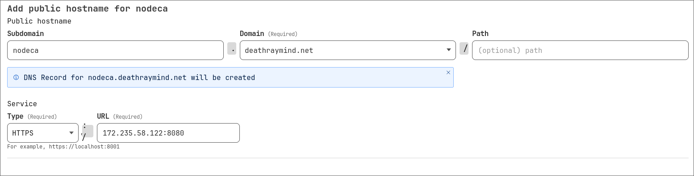
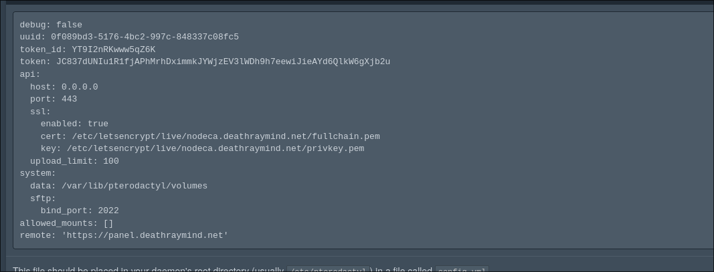
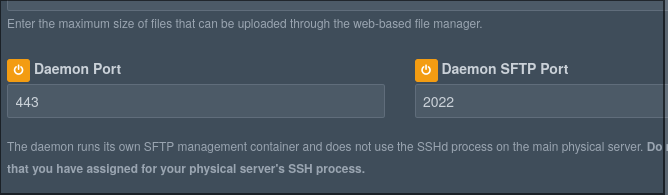

- ```bash 
  mkdir /etc/certs
  cd /etc/certs
  ```
- ```bash
  sudo apt update
  
  ```
- ```bash
  openssl req -new -newkey rsa:4096 -days 3650 -nodes -x509 -subj "/C=NA/ST=NA/L=NA/O=NA/CN=Generic SSL Certificate" -keyout privkey.pem -out fullchain.pem
  ```
- go to cloudflare >zero trust tunnels > docker and run the command on the server #homelab
- when you copy the docker command add the flag -d and --restart unless-stopped
- ```bash
  docker run -d --restart unless-stopped --name cloudflared cloudflare/cloudflared:latest tunnel --no-autoupdate run --token eyJhIjoiZWUyNWM4YTliZDQ3MDc5M2VlMDg3ZGFiYjE1ZjcwZmQiLCJ0IjoiYmY1N2Q3N2ItM2MyOS00OWRlLTk5ZjQtZGVhYWYzZmU0YzkxIiwicyI6Ik5qUm1aakU0WkRZdFpHUXhaQzAwTmpNMkxXSmpNVEV0TVdVeU5UazJaVGt5Wm1JMCJ9
  ```
- ```bash
  curl -sSL https://get.docker.com/ | CHANNEL=stable bash
  ```
- ```bash
  sudo systemctl enable --now docker
  ```
- ```bash
  sudo mkdir -p /etc/pterodactyl
  curl -L -o /usr/local/bin/wings "https://github.com/pterodactyl/wings/releases/latest/download/wings_linux_$([[ "$(uname -m)" == "x86_64" ]] && echo "amd64" || echo "arm64")"
  sudo chmod u+x /usr/local/bin/wings
  ```
- 
- click on aditoional settings and disable auto tls'
- **  **
- go here and put in this file
- ```bash
  export TERM=xterm
  ```
- ```bash
  nano /etc/pterodactyl/config.yml
  ```
- ```bash
  ***
      enabled: true
      cert: /etc/certs/fullchain.pem
      key: /etc/certs/privkey.pem
    upload_limit: 100
    ***
  ```
- then go back to here
- 
- and set back to 443